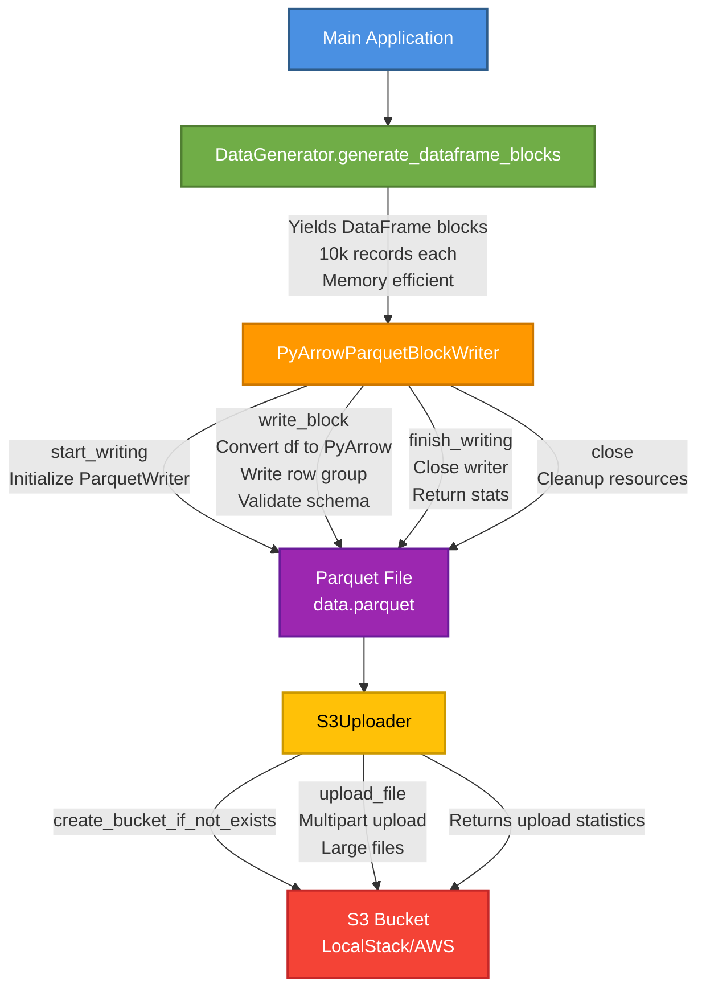
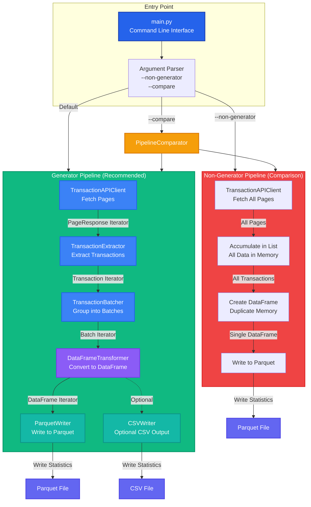
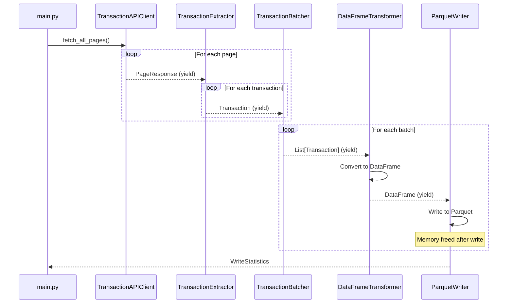
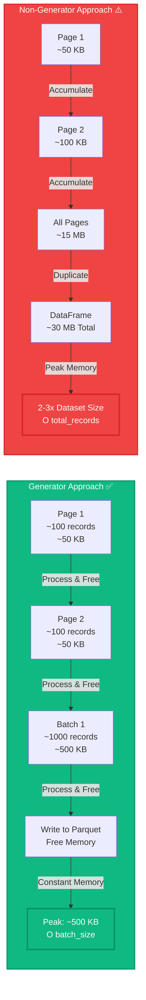
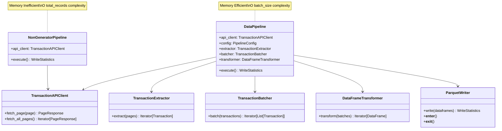

# Architecture Overview

> 📖 **See also**: [README.md](README.md) for project overview and [QUICKSTART.md](QUICKSTART.md) for getting started quickly.

## Block-Based Parquet Writing

This application uses a block-based approach to write Parquet files, allowing for efficient memory usage and streaming of large datasets.

## Components

### 1. ParquetBlockWriter Interface

**File**: `src/parquet_s3_blocks_writer/parquet_writer_interface.py`

An abstract base class that defines the contract for writing Parquet files in blocks:

```python
class ParquetBlockWriter(ABC):
    @abstractmethod
    def start_writing(self, output_path: str, compression: str = "snappy") -> None:
        """Initialize the writer and prepare for block writing."""

    @abstractmethod
    def write_block(self, df: pd.DataFrame) -> None:
        """Write a DataFrame block to the Parquet file."""

    @abstractmethod
    def finish_writing(self) -> dict:
        """Finalize the Parquet file and return statistics."""

    @abstractmethod
    def close(self) -> None:
        """Close the writer and release resources."""
```

### 2. PyArrowParquetBlockWriter

**File**: `src/parquet_s3_blocks_writer/parquet_writer.py`

Concrete implementation using PyArrow that:
- Accepts pandas DataFrames as blocks
- Writes them sequentially to a single Parquet file
- Maintains schema consistency across blocks
- Provides detailed statistics

**Usage Example:**

```python
from parquet_s3_blocks_writer.parquet_writer import PyArrowParquetBlockWriter
import pandas as pd

# Initialize writer
writer = PyArrowParquetBlockWriter(block_size_mb=1)

# Start writing
writer.start_writing("output.parquet", compression="snappy")

# Write multiple blocks
for df_block in generate_data_blocks():
    writer.write_block(df_block)

# Finish and get stats
stats = writer.finish_writing()
writer.close()

# Or use as context manager
with PyArrowParquetBlockWriter(block_size_mb=1) as writer:
    writer.start_writing("output.parquet")
    writer.write_block(df1)
    writer.write_block(df2)
    stats = writer.finish_writing()
```

### 3. DataGenerator

**File**: `src/parquet_s3_blocks_writer/data_generator.py`

Generates fake data using the Faker library with three main methods:

1. **`generate_table(num_records)`** - Returns PyArrow Table (legacy)
2. **`generate_dataframe(num_records)`** - Returns pandas DataFrame
3. **`generate_dataframe_blocks(total_records, block_size)`** - Generator that yields DataFrame blocks

**Usage Example:**

```python
from parquet_s3_blocks_writer.data_generator import DataGenerator

generator = DataGenerator(seed=42)

# Generate data in blocks (memory-efficient)
for df_block in generator.generate_dataframe_blocks(
    total_records=1000000,
    block_size=10000
):
    # Process each block
    writer.write_block(df_block)
```

### 4. S3Uploader

**File**: `src/parquet_s3_blocks_writer/s3_uploader.py`

Handles uploading files to S3 with:
- Support for LocalStack and AWS S3
- Automatic bucket creation
- Multipart upload for large files
- Chunk-based uploading

## Data Flow



## Generator-Based Pipeline Architecture

**File**: `src/parquet_s3_blocks_writer/generator/main.py`

The generator-based pipeline demonstrates SOLID principles and memory-efficient data processing using Python generators. It provides two approaches: a memory-efficient generator-based pipeline and a non-generator approach for comparison.

### Architecture Overview



### Generator Pipeline Data Flow



### Memory Usage Comparison



### Component Relationships



### Usage Examples

**Generator-Based Pipeline (Recommended):**
```bash
# Run generator-based pipeline (default - memory efficient)
python -m src.parquet_s3_blocks_writer.generator.main
```

**Non-Generator Pipeline (For Comparison):**
```bash
# Run non-generator pipeline
python -m src.parquet_s3_blocks_writer.generator.main --non-generator
```

**Compare Both Approaches:**
```bash
# Compare memory usage and performance
python -m src.parquet_s3_blocks_writer.generator.main --compare
```

### Key Benefits of Generator Approach

1. **Constant Memory Usage**: O(batch_size) instead of O(total_records)
2. **Scalability**: Can process datasets of any size
3. **Streaming**: Data flows through pipeline like a stream
4. **Resource Efficiency**: Memory freed immediately after processing
5. **SOLID Principles**: Clean separation of concerns, dependency inversion

### Memory Efficiency Comparison

| Approach | Memory Complexity | Peak Memory | Scalability |
|----------|------------------|-------------|-------------|
| **Generator** | O(batch_size) | ~500 KB - 10 MB | ✅ Unlimited |
| **Non-Generator** | O(total_records) | 2-3x dataset size | ❌ Limited by RAM |

## Key Features

### 1. Memory Efficiency

Instead of loading all data into memory, the application:
- Generates data in blocks
- Writes each block immediately
- Releases memory after each block

### 2. Schema Validation

The writer ensures schema consistency:
- First block defines the schema
- Subsequent blocks must match
- Raises `ValueError` on mismatch

### 3. Flexible Block Sizes

Configure block sizes via:
- `BLOCK_SIZE_MB` - Target size for Parquet row groups
- Records per block calculated dynamically
- Adjusts based on estimated bytes per record

### 4. Progress Tracking

Detailed logging at each stage:
- Block generation progress
- Write statistics per block
- Total rows, columns, file size
- Upload progress

## Configuration

**Environment Variables** (`.env` file):

```env
# Application Settings
TARGET_DATA_SIZE_MB=10      # Target total data size
BLOCK_SIZE_MB=1             # Target block size (row group)
NUM_RECORDS=100000          # Total records to generate

# S3 Settings
S3_ENDPOINT_URL=http://localhost:4566  # LocalStack
AWS_REGION=us-east-1
AWS_ACCESS_KEY_ID=test
AWS_SECRET_ACCESS_KEY=test
S3_BUCKET_NAME=parquet-data-bucket
```

## Extending the System

### Creating a New Writer Implementation

To create a new Parquet writer (e.g., for direct S3 writing):

```python
from parquet_s3_blocks_writer.parquet_writer_interface import ParquetBlockWriter
import pandas as pd

class S3DirectParquetWriter(ParquetBlockWriter):
    """Write directly to S3 without local file."""

    def __init__(self, s3_client, block_size_mb: int = 1):
        self.s3_client = s3_client
        self.block_size_mb = block_size_mb

    def start_writing(self, output_path: str, compression: str = "snappy"):
        # Initialize multipart upload
        pass

    def write_block(self, df: pd.DataFrame):
        # Write block directly to S3
        pass

    def finish_writing(self) -> dict:
        # Complete multipart upload
        pass

    def close(self):
        # Cleanup
        pass
```

### Adding New Data Sources

Extend `DataGenerator` or create a new generator:

```python
class CSVDataGenerator:
    """Generate blocks from CSV file."""

    def generate_dataframe_blocks(self, csv_path: str, block_size: int):
        for chunk in pd.read_csv(csv_path, chunksize=block_size):
            yield chunk
```

## Performance Considerations

1. **Block Size**: Larger blocks = fewer I/O operations but more memory
2. **Compression**: Snappy is fast, gzip is smaller, zstd is balanced
3. **Record Complexity**: More columns/larger strings = more memory per record
4. **S3 Multipart**: Chunks should be at least 5MB for AWS S3

## Testing

The application includes comprehensive tests:

- `tests/test_data_generator.py` - Data generation tests
- `tests/test_parquet_writer.py` - Writer interface and implementation tests

Run tests:
```bash
poetry run pytest -v
```

## Related Documentation

- **[README.md](README.md)** - Project overview and main documentation
- **[QUICKSTART.md](QUICKSTART.md)** - Quick start guide
- **[WRITERS_COMPARISON.md](WRITERS_COMPARISON.md)** - Comparison of writer implementations
- **[docs/parquet-writer-s3-output-stream.md](docs/parquet-writer-s3-output-stream.md)** - Technical deep dive into S3 streaming
- **[docs/python-generators-crash-course.md](docs/python-generators-crash-course.md)** - Comprehensive Python generators tutorial
