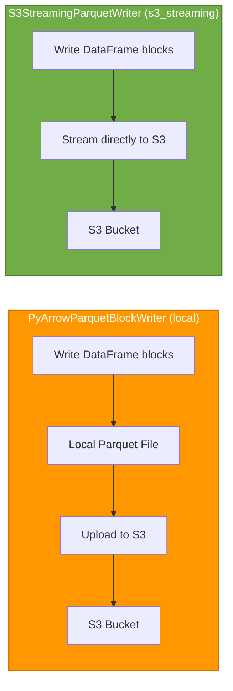

# Parquet Writer Implementations Comparison

> 📖 **See also**: [README.md](README.md) for project overview and [ARCHITECTURE.md](ARCHITECTURE.md) for architecture details.

This document compares the two different Parquet writer implementations available in this project.

## Overview

The project provides two different strategies for writing Parquet files to S3:

1. **PyArrowParquetBlockWriter** (`local`) - Write to local filesystem, then upload
2. **S3StreamingParquetWriter** (`s3_streaming`) - Direct to S3 using PyArrow's streaming writer

## Implementation Details

### 1. PyArrowParquetBlockWriter (local)

**File**: `src/parquet_s3_blocks_writer/parquet_writer.py`

**How it works**:
1. Writes DataFrame blocks to a local Parquet file
2. Uses PyArrow's ParquetWriter
3. After completion, uploads the file to S3 using boto3

**Advantages**:
- Simple and straightforward
- Can easily inspect/test local file before upload
- Reliable - local filesystem is stable
- Good for small to medium files

**Disadvantages**:
- Requires local disk space
- Two-step process (write + upload)
- Not suitable for very large files that don't fit on disk

**Best for**:
- Development and testing
- When local file inspection is needed
- Smaller datasets (<10GB)
- Systems with ample local storage

### 2. S3StreamingParquetWriter (s3_streaming)

**File**: `src/parquet_s3_blocks_writer/s3_streaming_parquet_writer.py`

**How it works**:
1. Creates a PyArrow S3FileSystem connection
2. Uses PyArrow's ParquetWriter with the S3 filesystem
3. Each `write_block()` call writes a row group
4. PyArrow handles multipart uploads automatically
5. `close()` writes the Parquet footer and finalizes the file

**Implementation**:
```python
import pyarrow as pa
import pyarrow.parquet as pq
import pyarrow.fs as pafs

# Create S3 filesystem
fs = pafs.S3FileSystem(
    access_key=aws_access_key_id,
    secret_key=aws_secret_access_key,
    endpoint_override=endpoint_url,  # Optional for LocalStack
    region=region_name,
)

# Create writer with S3 filesystem
writer = pq.ParquetWriter(
    "bucket/key.parquet",
    schema,
    filesystem=fs,
    compression='snappy'
)

# Write blocks as row groups
for df_block in blocks:
    table = pa.Table.from_pandas(df_block)
    writer.write_table(table)  # Writes as a row group

# Close writer - writes footer and completes upload
writer.close()
```

**Advantages**:
- Simple and clean implementation
- PyArrow handles multipart uploads internally
- Each block becomes a row group (proper Parquet structure)
- No manual state management needed
- Works seamlessly with both AWS S3 and LocalStack
- Memory efficient streaming

**Disadvantages**:
- Less control over individual upload parts
- PyArrow manages the buffer sizes internally

**Best for**:
- Direct S3 writes (recommended approach)
- Production use cases
- Any file size
- When you want PyArrow to handle the complexity

## Performance Comparison



| Feature | Local | S3 Streaming |
|---------|-------|--------------|
| **Disk Space** | Required | Not required |
| **Memory Usage** | Low | Low |
| **Complexity** | Low | Low |
| **Upload Control** | High (separate step) | Automatic |
| **Network Efficiency** | N/A (single upload) | Streaming with automatic multipart |
| **Best for File Size** | < 10GB | Any size |
| **Parquet Structure** | Correct | Correct (row groups) |

## Configuration

Set the writer type via environment variable:

```bash
# .env file
WRITER_TYPE=s3_streaming  # Options: local, s3_streaming
```

Or via code:

```python
from parquet_s3_blocks_writer import (
    PyArrowParquetBlockWriter,
    S3StreamingParquetWriter
)
from parquet_s3_blocks_writer.config import S3Config

s3_config = S3Config.from_env()

# Choose one:
writer = PyArrowParquetBlockWriter(block_size_mb=1)
# or
writer = S3StreamingParquetWriter(s3_config, block_size_mb=1)
```

## Usage Examples

Both implementations use the same interface:

```python
# Initialize
writer.start_writing("output.parquet", compression="snappy")

# Write blocks
for df_block in generate_blocks():
    writer.write_block(df_block)

# Finish
stats = writer.finish_writing()
writer.close()
```

## Recommendations

### Use `local` when:
- Developing and testing
- Need to inspect files before upload
- File size < 10GB
- Have plenty of local storage

### Use `s3_streaming` when:
- Need direct S3 writes (recommended)
- Any file size
- Production deployments
- Want PyArrow to handle multipart uploads automatically

## Dependencies

- **PyArrowParquetBlockWriter**: pyarrow, boto3 (for upload)
- **S3StreamingParquetWriter**: pyarrow (with S3FileSystem support)

## Performance Tips

1. **Block Size**: Adjust `BLOCK_SIZE_MB` based on your data
   - Larger blocks = fewer row groups, better compression
   - Smaller blocks = more row groups, better for selective reads
   - Recommended: 64-128MB for production workloads

2. **Compression**: Choose based on your needs
   - `snappy`: Fast, moderate compression (default, recommended)
   - `gzip`: Slower, better compression ratio
   - `zstd`: Balanced, modern (good for large files)
   - `brotli`: High compression, slower

3. **PyArrow Buffer Management**:
   - PyArrow handles multipart uploads automatically
   - Default part size is managed by PyArrow based on data size
   - No manual buffer tuning needed

## Related Documentation

- **[README.md](README.md)** - Project overview and main documentation
- **[ARCHITECTURE.md](ARCHITECTURE.md)** - Detailed architecture documentation
- **[QUICKSTART.md](QUICKSTART.md)** - Quick start guide
- **[docs/parquet-writer-s3-output-stream.md](docs/parquet-writer-s3-output-stream.md)** - Technical deep dive into how ParquetWriter works with S3