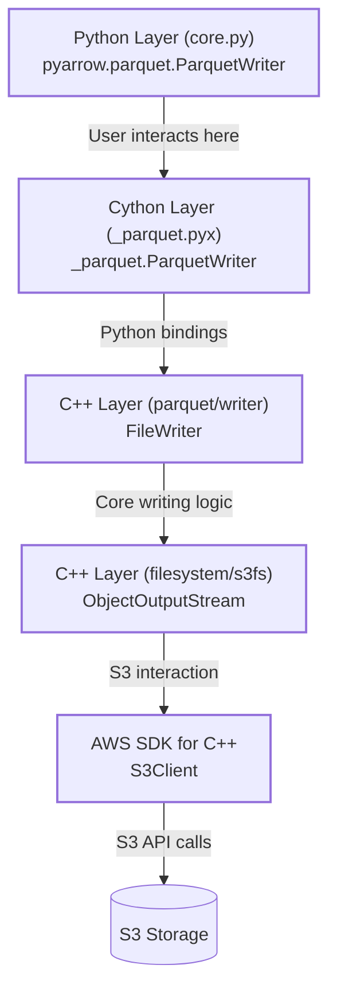
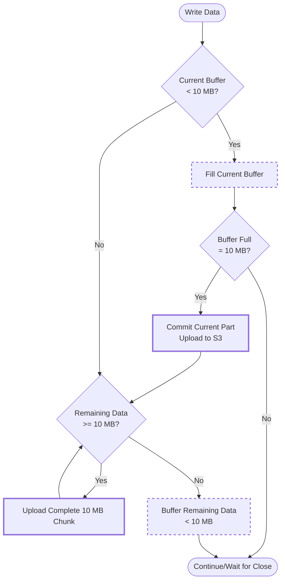
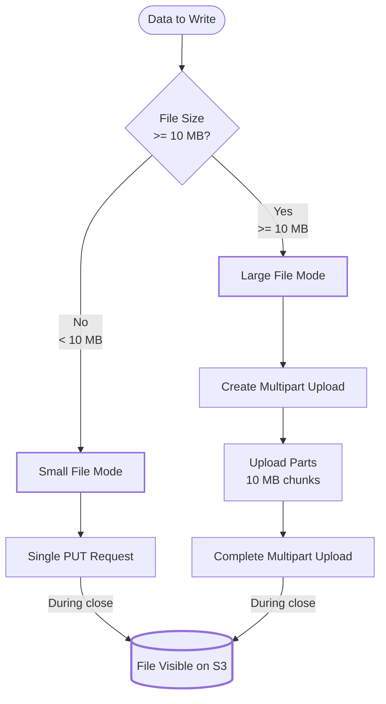
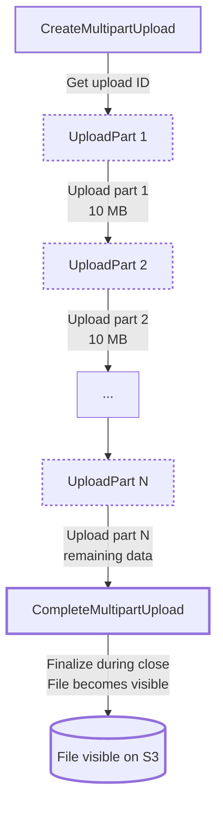
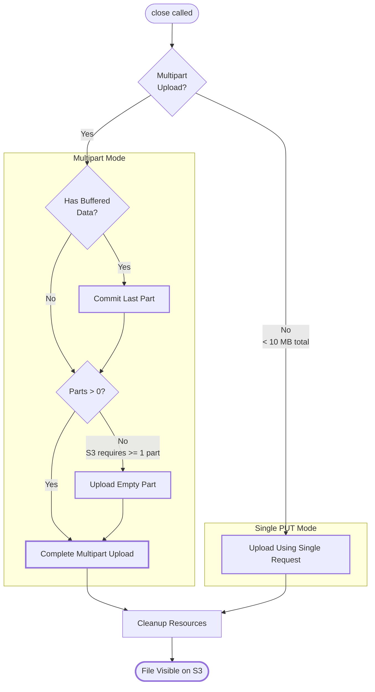

# How ParquetWriter Works Under the Hood with S3 Output Stream

## Overview

This document provides a detailed technical explanation of how PyArrow's `ParquetWriter` handles writing Parquet files to Amazon S3, covering the complete data flow from the Python API down to the S3 multipart upload mechanism.

## Table of Contents

1. [Architecture Overview](#architecture-overview)
2. [Layer-by-Layer Flow](#layer-by-layer-flow)
3. [S3 Output Stream Implementation](#s3-output-stream-implementation)
4. [Memory Buffering Strategy](#memory-buffering-strategy)
5. [Multipart Upload Mechanism](#multipart-upload-mechanism)
6. [The Close Operation](#the-close-operation)
7. [Important Implications](#important-implications)
8. [Best Practices](#best-practices)

---

## Architecture Overview

PyArrow's ParquetWriter uses a multi-layered architecture to write data to S3:



---

## Layer-by-Layer Flow

### 1. Python Layer (`pyarrow/parquet/core.py`)

When you create a `ParquetWriter` with an S3 path:

```python
import pyarrow.parquet as pq

writer = pq.ParquetWriter(
    's3://bucket/path/file.parquet',
    schema,
    filesystem=s3_filesystem
)
```

**What happens:**

```python
# Location: python/pyarrow/parquet/core.py:1066-1074
filesystem, path = _resolve_filesystem_and_path(where, filesystem)
if filesystem is not None:
    # Opens an output stream from the S3 filesystem
    sink = self.file_handle = filesystem.open_output_stream(
        path, compression=None)
else:
    sink = where
```

The Python layer:
- Resolves the S3 path and filesystem
- Calls `filesystem.open_output_stream()` which returns an S3 output stream
- Passes this stream (sink) to the Cython layer

### 2. Cython Layer (`pyarrow/_parquet.pyx`)

The Python `ParquetWriter` creates a Cython `_parquet.ParquetWriter`:

```cython
# Location: python/pyarrow/_parquet.pyx:2296-2370
cdef class ParquetWriter(_Weakrefable):
    cdef:
        unique_ptr[FileWriter] writer
        shared_ptr[COutputStream] sink
        bint own_sink

    def __cinit__(self, where, Schema schema not None, ...):
        # Get the output stream
        get_writer(where, &self.sink)
        
        # Create C++ FileWriter
        self.writer = move(GetResultValue(
            FileWriter.Open(deref(schema.schema), pool,
                          self.sink, properties, arrow_properties)))
```

**Key methods:**

#### `write_table()`
```cython
# Location: python/pyarrow/_parquet.pyx:2378-2392
def write_table(self, Table table, row_group_size=None):
    cdef:
        CTable* ctable = table.table
        int64_t c_row_group_size

    if row_group_size is None or row_group_size == -1:
        c_row_group_size = min(ctable.num_rows(), _DEFAULT_ROW_GROUP_SIZE)
    
    with nogil:
        check_status(self.writer.get()
                     .WriteTable(deref(ctable), c_row_group_size))
```

- Determines row group size (default: 1,048,576 rows)
- Calls C++ `FileWriter::WriteTable()`
- **Data is written to the output stream here**

#### `close()`
```cython
# Location: python/pyarrow/_parquet.pyx:2372-2376
def close(self):
    with nogil:
        check_status(self.writer.get().Close())
        if self.own_sink:
            check_status(self.sink.get().Close())
```

- Closes the C++ FileWriter (writes Parquet metadata/footer)
- Closes the output stream (finalizes S3 upload)

### 3. C++ Parquet Writer Layer

The C++ `FileWriter` handles:
- Converting Arrow data to Parquet format
- Writing row groups
- Managing Parquet schema and metadata
- Writing data pages to the output stream

### 4. C++ S3 Filesystem Layer (`cpp/src/arrow/filesystem/s3fs.cc`)

This is where the S3-specific magic happens!

---

## S3 Output Stream Implementation

### Key Constants

```cpp
// Location: cpp/src/arrow/filesystem/s3fs.cc:1589-1594
static constexpr int64_t kPartUploadSize = 10 * 1024 * 1024;  // 10 MB

// Above this threshold, use multipart upload
static constexpr int64_t kMultiPartUploadThresholdSize = kPartUploadSize - 1;
```

### ObjectOutputStream Class

The `ObjectOutputStream` class handles all writes to S3:

```cpp
// Location: cpp/src/arrow/filesystem/s3fs.cc:1601
class ObjectOutputStream final : public io::OutputStream {
  // Manages S3 multipart uploads
  // Buffers data in memory
  // Uploads parts when buffer is full
}
```

---

## Memory Buffering Strategy

### How Buffering Works

When you write data to S3, it goes through this buffer management:



```cpp
// Location: cpp/src/arrow/filesystem/s3fs.cc:1833-1883
Status Write(const void* data, int64_t nbytes) {
    // 1. Fill current buffer (up to 10 MB)
    if (current_part_size_ > 0) {
        const int64_t to_copy = std::min(nbytes, kPartUploadSize - current_part_size_);
        RETURN_NOT_OK(current_part_->Write(data_ptr, to_copy));
        current_part_size_ += to_copy;
        
        // If buffer is full, upload it
        if (current_part_size_ >= kPartUploadSize) {
            RETURN_NOT_OK(CommitCurrentPart());
        }
    }
    
    // 2. Upload complete 10 MB chunks directly
    while (nbytes >= kPartUploadSize) {
        RETURN_NOT_OK(UploadPart(data_ptr, kPartUploadSize));
        advance_ptr(kPartUploadSize);
    }
    
    // 3. Buffer remaining bytes
    if (nbytes > 0) {
        current_part_size_ = nbytes;
        RETURN_NOT_OK(current_part_->Write(data_ptr, current_part_size_));
    }
}
```

**Buffer Strategy:**
1. Accumulate data in a memory buffer until 10 MB
2. Upload complete 10 MB parts immediately
3. Buffer any remaining data (< 10 MB) for the next write or close

---

## Multipart Upload Mechanism

S3 doesn't support streaming writes like a traditional filesystem. Instead, it uses [S3 Multipart Upload](https://docs.aws.amazon.com/AmazonS3/latest/userguide/mpuoverview.html):

### Two Upload Modes



#### Mode 1: Small Files (< 10 MB)

```cpp
// Single PUT request
Status UploadUsingSingleRequest() {
    // Create a PutObjectRequest
    // Upload entire buffer in one HTTP request
    // Only happens during close()
}
```

**Characteristics:**
- Entire file buffered in memory
- One S3 API call
- File appears on S3 only after `close()` completes

#### Mode 2: Large Files (≥ 10 MB)

```cpp
// Location: cpp/src/arrow/filesystem/s3fs.cc:1656-1677
Status CreateMultipartUpload() {
    // Initiate multipart upload
    S3Model::CreateMultipartUploadRequest req;
    auto outcome = client->CreateMultipartUpload(req);
    multipart_upload_id_ = outcome.GetResult().GetUploadId();
}
```

**Multipart Upload Flow:**



**Characteristics:**
- Initiated when first 10 MB is written
- Each 10 MB chunk uploaded immediately
- Parts stored separately on S3 (not visible to users)
- File becomes visible only after `CompleteMultipartUpload`

### Upload Part Implementation

```cpp
// Location: cpp/src/arrow/filesystem/s3fs.cc:1902-1999
Status UploadPart(const void* data, int64_t nbytes) {
    S3Model::UploadPartRequest req;
    req.SetBucket(path_.bucket);
    req.SetKey(path_.key);
    req.SetPartNumber(part_number_);
    req.SetUploadId(multipart_upload_id_);
    req.SetContentLength(nbytes);
    req.SetBody(std::make_shared<StringViewStream>(data, nbytes));
    
    // Upload to S3
    auto outcome = client->UploadPart(req);
    
    // Store ETag for final completion
    etags_.push_back(outcome.GetResult().GetETag());
    part_number_++;
}
```

---

## The Close Operation

The `close()` operation is **critical** for S3 writes. Here's what happens:



### Step 1: Ensure Ready to Flush

```cpp
// Location: cpp/src/arrow/filesystem/s3fs.cc:1730-1746
Status EnsureReadyToFlushFromClose() {
    if (ShouldBeMultipartUpload()) {
        // Upload last buffered part
        if (current_part_) {
            RETURN_NOT_OK(CommitCurrentPart());
        }
        
        // S3 requires at least one part
        if (part_number_ == 1) {
            RETURN_NOT_OK(UploadPart("", 0));
        }
    } else {
        // Upload everything in a single request
        RETURN_NOT_OK(UploadUsingSingleRequest());
    }
}
```

### Step 2: Complete Multipart Upload

```cpp
Status CompleteMultipartUpload() {
    S3Model::CompleteMultipartUploadRequest req;
    req.SetBucket(path_.bucket);
    req.SetKey(path_.key);
    req.SetUploadId(multipart_upload_id_);
    
    // Attach all part ETags
    S3Model::CompletedMultipartUpload completed_upload;
    for (int part_num = 1; part_num <= etags_.size(); ++part_num) {
        S3Model::CompletedPart part;
        part.SetPartNumber(part_num);
        part.SetETag(etags_[part_num - 1]);
        completed_upload.AddParts(part);
    }
    req.SetMultipartUpload(completed_upload);
    
    // Finalize the upload - file becomes visible now!
    auto outcome = client->CompleteMultipartUpload(req);
}
```

### Step 3: Cleanup

```cpp
Status CleanupAfterClose() {
    current_part_.reset();
    holder_ = nullptr;
    closed_ = true;
    return Status::OK();
}
```

---

## Important Implications

### 1. File Visibility

**❌ File is NOT visible during writes:**
```python
writer = pq.ParquetWriter('s3://bucket/file.parquet', schema)
writer.write_table(table)  # File doesn't exist on S3 yet!
# Another process trying to read the file will get "Not Found"
```

**✅ File is visible only after close:**
```python
writer.close()  # NOW the file appears on S3
# OR
with pq.ParquetWriter('s3://bucket/file.parquet', schema) as writer:
    writer.write_table(table)
# File appears here after context manager exits
```

### 2. Memory Usage

**Minimum memory overhead:**
- At least **10 MB per concurrent writer**
- Plus Arrow table memory
- Plus Parquet encoding buffers

**Example with 10 parallel writers:**
```python
# Each writer buffers up to 10 MB
# Total memory overhead: ~100 MB minimum
for i in range(10):
    writers.append(pq.ParquetWriter(f's3://bucket/file_{i}.parquet', schema))
```

### 3. Atomicity

**Transactional behavior:**
- From a reader's perspective, writes are "atomic"
- Either the complete file exists, or nothing
- No partial/corrupt files visible to readers

**However:**
- If process crashes before `close()`, orphaned multipart uploads remain
- These consume S3 storage until cleaned up
- Use S3 lifecycle policies to auto-cleanup incomplete multiparts

### 4. Error Handling

**If upload fails:**
```python
try:
    with pq.ParquetWriter('s3://bucket/file.parquet', schema) as writer:
        writer.write_table(table)
except Exception as e:
    # Multipart upload may be incomplete
    # File won't be visible, but parts may remain on S3
    # Need lifecycle policy to clean up
```

### 5. Performance Characteristics

**Network I/O pattern:**

```mermaid
gantt
    title S3 Upload Performance Timeline
    dateFormat X
    axisFormat %s
    
    section write_table()
    Buffer (0-10 MB) [Memory]        :done, buffer1, 0, 2
    Upload Part 1 (10 MB) [Network]  :active, upload1, 2, 10
    Upload Part 2 (10 MB) [Network]  :active, upload2, 10, 18
    Upload Part N (10 MB) [Network]  :active, uploadN, 18, 26
    Buffer remaining [Memory]        :done, buffer2, 26, 28
    
    section close()
    Upload last part [Network]       :crit, lastpart, 28, 31
    Complete multipart [Network]     :crit, complete, 31, 32
```



**Optimization opportunity:**
- Background uploads (`background_writes=True` in S3Options)
- Uploads happen in parallel with data preparation
- Can significantly improve throughput

---

## Best Practices

### 1. Always Use Context Managers

**✅ Good:**
```python
with pq.ParquetWriter(s3_path, schema, filesystem=s3fs) as writer:
    writer.write_table(table)
# Guaranteed to close properly
```

**❌ Bad:**
```python
writer = pq.ParquetWriter(s3_path, schema, filesystem=s3fs)
writer.write_table(table)
# If exception occurs, close() might not be called!
# Orphaned multipart upload on S3
```

### 2. Configure S3 Lifecycle Policies

Set up automatic cleanup of incomplete multipart uploads:

```json
{
  "Rules": [{
    "Id": "cleanup-incomplete-multipart",
    "Status": "Enabled",
    "AbortIncompleteMultipartUpload": {
      "DaysAfterInitiation": 7
    }
  }]
}
```

### 3. Monitor Memory Usage

For large-scale parallel writes:

```python
import pyarrow.parquet as pq
from concurrent.futures import ThreadPoolExecutor

# Limit concurrent writers to manage memory
max_writers = 20  # ~200 MB overhead (10 MB each)

with ThreadPoolExecutor(max_workers=max_writers) as executor:
    futures = []
    for i in range(1000):
        future = executor.submit(write_partition, i)
        futures.append(future)
    
    # Process results
    for future in futures:
        future.result()
```

### 4. Configure S3Options for Performance

```python
from pyarrow import fs

s3 = fs.S3FileSystem(
    # Enable background uploads for better performance
    background_writes=True,
    
    # Allow delayed multipart initiation (single-request for small files)
    allow_delayed_open=True,
    
    # Connection pool for parallel uploads
    ...
)

pq.write_table(table, 's3://bucket/file.parquet', filesystem=s3)
```

### 5. Handle Large Tables Appropriately

```python
# For very large tables, consider:
# 1. Controlling row group size
with pq.ParquetWriter(s3_path, schema, filesystem=s3fs) as writer:
    # Write in smaller row groups (less memory per flush)
    for batch in batches:
        writer.write_table(batch, row_group_size=100_000)

# 2. Or use write_table with partitioning
import pyarrow.dataset as ds

ds.write_dataset(
    large_table,
    's3://bucket/dataset/',
    format='parquet',
    filesystem=s3fs,
    partitioning=['year', 'month'],
    # Splits into multiple files automatically
)
```

### 6. Error Recovery

```python
import logging

def safe_write_parquet(table, s3_path, s3fs, max_retries=3):
    for attempt in range(max_retries):
        try:
            with pq.ParquetWriter(s3_path, table.schema, filesystem=s3fs) as writer:
                writer.write_table(table)
            return True
        except Exception as e:
            logging.error(f"Attempt {attempt + 1} failed: {e}")
            if attempt == max_retries - 1:
                raise
            # Exponential backoff
            time.sleep(2 ** attempt)
    return False
```

---

## Summary

**Key Takeaways:**

1. **Three-layer architecture**: Python → Cython → C++ (with S3 SDK)

2. **Buffering strategy**: 10 MB parts buffered in memory before upload

3. **Two upload modes**:
   - Small files (< 10 MB): Single PUT during close
   - Large files (≥ 10 MB): Multipart upload with 10 MB chunks

4. **File visibility**: Files appear on S3 only after `close()` completes

5. **Memory overhead**: ~10 MB per writer minimum

6. **Atomic behavior**: Readers see complete files or nothing

7. **Always use context managers** to ensure proper cleanup

8. **Configure S3 lifecycle policies** to cleanup incomplete uploads

Understanding this flow helps you:
- Optimize memory usage for parallel writes
- Handle errors appropriately
- Configure S3 settings for your use case
- Debug issues when they arise
- Design robust data pipelines

---

## References

- [AWS S3 Multipart Upload Documentation](https://docs.aws.amazon.com/AmazonS3/latest/userguide/mpuoverview.html)
- [Apache Arrow C++ S3 Filesystem Source](https://github.com/apache/arrow/blob/main/cpp/src/arrow/filesystem/s3fs.cc)
- [PyArrow Parquet Module](https://arrow.apache.org/docs/python/parquet.html)
- [Apache Parquet Format Specification](https://parquet.apache.org/docs/file-format/)

