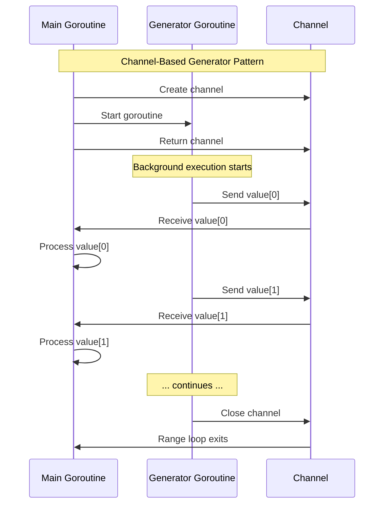
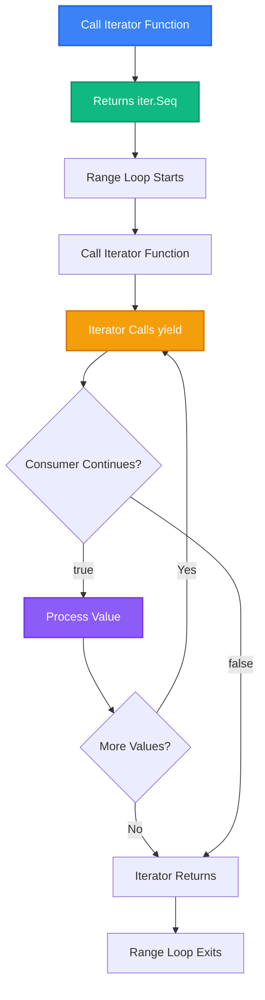
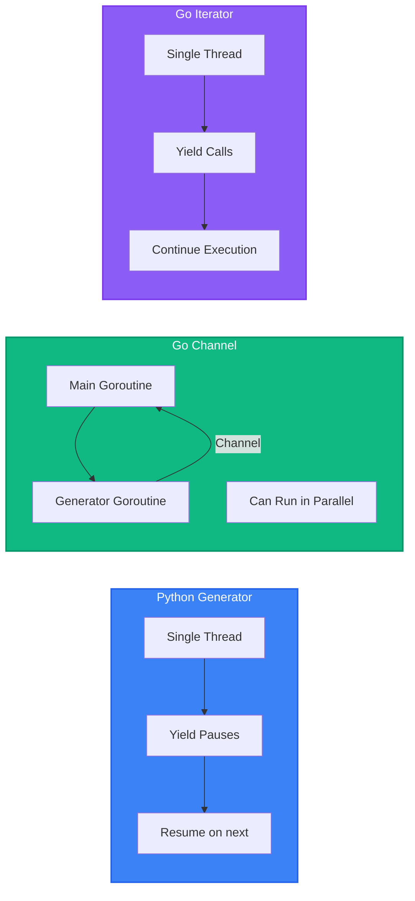

# Implementing Python Generators in Go

This guide shows how to implement the same memory-efficient, lazy evaluation pattern from Python generators in Go using two approaches:

1. **Channels** (Traditional Go approach - works in all Go versions)
2. **Iterators** (Go 1.23+ range-over-func support)

## Table of Contents

1. [Python Generator Recap](#python-generator-recap)
2. [Go Approach 1: Channels](#go-approach-1-channels)
3. [Go Approach 2: Iterators (Go 1.23+)](#go-approach-2-iterators-go-123)
4. [Memory Comparison](#memory-comparison)
5. [Performance Considerations](#performance-considerations)
6. [Complete Examples](#complete-examples)

---

## Python Generator Recap

The Python example demonstrates:

```python
# Memory-intensive: Creates entire list
def get_numbers(n):
    result = []
    for i in range(n):
        result.append(i * 2)
    return result  # 1M items in memory

# Generator: Creates values on-demand
def get_numbers_generator(n):
    for i in range(n):
        yield i * 2  # One value at a time
```

**Key characteristics:**
- Lazy evaluation (values created on-demand)
- Constant memory usage (~750 bytes)
- State preservation between calls
- Single-pass iteration

---

## Go Approach 1: Channels

### Concept

Channels in Go provide a way to communicate between goroutines. When combined with goroutines, they can simulate Python's generator behavior:

- **Goroutine**: Produces values in the background
- **Channel**: Transmits values one at a time
- **Close channel**: Signals completion (like `StopIteration`)

### Basic Implementation

```go
package main

import "fmt"

// Generator function using channel
func getNumbersGenerator(n int) <-chan int {
    ch := make(chan int)
    
    go func() {
        defer close(ch)  // Signal completion
        for i := 0; i < n; i++ {
            ch <- i * 2  // Send value (blocks until received)
        }
    }()
    
    return ch  // Return receive-only channel
}

func main() {
    // Create generator
    gen := getNumbersGenerator(1_000_000)
    
    // Consume values
    count := 0
    for value := range gen {
        if count < 10 {
            fmt.Printf("%d ", value)
        }
        count++
        if count >= 10 {
            break  // Stop after 10 values
        }
    }
    // Output: 0 2 4 6 8 10 12 14 16 18
}
```

### How It Works



### Channel Generator Pattern

```go
// Standard pattern for channel-based generators
func generatorFunction(params) <-chan Type {
    ch := make(chan Type)  // Create channel
    
    go func() {            // Start goroutine
        defer close(ch)     // Always close when done
        
        // Produce values
        for condition {
            value := computeValue()
            ch <- value    // Send (blocks if buffer full)
        }
    }()
    
    return ch              // Return receive-only channel
}

// Usage
for value := range generatorFunction(args) {
    // Process value
}
```

### Memory Characteristics

**Channel Generator Memory:**
- Channel buffer: ~96 bytes (unbuffered) or buffer size
- Goroutine stack: ~2-8 KB (initial)
- Local variables: Minimal (only current state)
- **Total**: ~2-10 KB (constant, regardless of sequence size)

### Advantages & Disadvantages

**Advantages:**
- ✅ Works in all Go versions
- ✅ True concurrency (can run in parallel)
- ✅ Familiar Go pattern
- ✅ Can be cancelled with context

**Disadvantages:**
- ⚠️ Requires goroutine (slight overhead)
- ⚠️ Channel synchronization overhead
- ⚠️ More verbose than Python generators

---

## Go Approach 2: Iterators (Go 1.23+)

### Concept

Go 1.23 introduced **range-over-func** support, allowing custom iterator types that work directly with `for range` loops. This is closer to Python's generator syntax.

### Basic Implementation

```go
package main

import (
    "fmt"
    "iter"
)

// Iterator function (returns iter.Seq[int])
func getNumbersIterator(n int) iter.Seq[int] {
    return func(yield func(int) bool) {
        for i := 0; i < n; i++ {
            if !yield(i * 2) {
                return  // Consumer stopped iteration
            }
        }
    }
}

func main() {
    // Use with range (just like Python!)
    count := 0
    for value := range getNumbersIterator(1_000_000) {
        if count < 10 {
            fmt.Printf("%d ", value)
        }
        count++
        if count >= 10 {
            break
        }
    }
    // Output: 0 2 4 6 8 10 12 14 16 18
}
```

### How It Works



### Iterator Function Signature

```go
// Iterator function type
type Seq[V any] func(yield func(V) bool)

// Your iterator function
func myIterator() iter.Seq[int] {
    return func(yield func(int) bool) {
        // Produce values by calling yield
        for i := 0; i < 10; i++ {
            if !yield(i) {  // If yield returns false, stop
                return
            }
        }
    }
}

// Usage
for value := range myIterator() {
    fmt.Println(value)
}
```

### Memory Characteristics

**Iterator Memory:**
- Function closure: ~100-200 bytes
- Local variables: Minimal (only current state)
- **Total**: ~200-500 bytes (constant, regardless of sequence size)

**Even more efficient than channels!**

### Advantages & Disadvantages

**Advantages:**
- ✅ Most similar to Python generators
- ✅ No goroutine overhead
- ✅ No channel synchronization
- ✅ Clean, readable syntax
- ✅ Most memory efficient

**Disadvantages:**
- ⚠️ Requires Go 1.23+ (released August 2024)
- ⚠️ Newer feature (less widespread adoption)

---

## Memory Comparison

### Python vs Go Approaches


### Memory Usage Table

| Approach | Base Memory | Per Item | 1M Items | Scalability |
|----------|-------------|----------|-----------|-------------|
| **Python List** | 56 bytes | 28 bytes | ~28 MB | ❌ Linear |
| **Python Generator** | ~750 bytes | 0 bytes | ~750 bytes | ✅ Constant |
| **Go Slice** | 24 bytes | 8 bytes | ~8 MB | ❌ Linear |
| **Go Channel** | ~2-10 KB | 0 bytes | ~2-10 KB | ✅ Constant |
| **Go Iterator** | ~250 bytes | 0 bytes | ~250 bytes | ✅ Constant |

**Winner: Go Iterator** (most memory efficient!)

---

## Performance Considerations

### Execution Model Comparison



### Performance Characteristics

| Aspect | Python Generator | Go Channel | Go Iterator |
|--------|------------------|------------|-------------|
| **Memory** | ~750 bytes | ~2-10 KB | ~250 bytes |
| **CPU Overhead** | Low | Medium (goroutine) | Low |
| **Concurrency** | No | Yes | No |
| **Latency** | Low | Medium (channel sync) | Low |
| **Throughput** | High | Medium-High | High |

### When to Use Each

**Use Go Channels when:**
- You need true concurrency
- You want to process values in parallel
- You need cancellation with context
- Working with Go < 1.23

**Use Go Iterators when:**
- You want Python-like syntax
- Maximum memory efficiency needed
- Single-threaded processing is fine
- Using Go 1.23+

---

## Complete Examples

### Example 1: Basic Number Generator

**Python:**
```python
def get_numbers_generator(n):
    for i in range(n):
        yield i * 2
```

**Go with Channels:**
```go
func getNumbersGenerator(n int) <-chan int {
    ch := make(chan int)
    go func() {
        defer close(ch)
        for i := 0; i < n; i++ {
            ch <- i * 2
        }
    }()
    return ch
}

// Usage
for value := range getNumbersGenerator(1_000_000) {
    // Process value
}
```

**Go with Iterators:**
```go
func getNumbersIterator(n int) iter.Seq[int] {
    return func(yield func(int) bool) {
        for i := 0; i < n; i++ {
            if !yield(i * 2) {
                return
            }
        }
    }
}

// Usage
for value := range getNumbersIterator(1_000_000) {
    // Process value
}
```

### Example 2: Filtering Pipeline

**Python:**
```python
def filter_even(numbers):
    for n in numbers:
        if n % 2 == 0:
            yield n

def multiply(numbers, factor):
    for n in numbers:
        yield n * factor

# Chain generators
result = multiply(filter_even(range(100)), 3)
```

**Go with Channels:**
```go
func filterEven(input <-chan int) <-chan int {
    ch := make(chan int)
    go func() {
        defer close(ch)
        for n := range input {
            if n%2 == 0 {
                ch <- n
            }
        }
    }()
    return ch
}

func multiply(input <-chan int, factor int) <-chan int {
    ch := make(chan int)
    go func() {
        defer close(ch)
        for n := range input {
            ch <- n * factor
        }
    }()
    return ch
}

// Usage
numbers := generateNumbers(100)
filtered := filterEven(numbers)
result := multiply(filtered, 3)

for value := range result {
    // Process value
}
```

**Go with Iterators:**
```go
func filterEven(seq iter.Seq[int]) iter.Seq[int] {
    return func(yield func(int) bool) {
        for n := range seq {
            if n%2 == 0 {
                if !yield(n) {
                    return
                }
            }
        }
    }
}

func multiply(seq iter.Seq[int], factor int) iter.Seq[int] {
    return func(yield func(int) bool) {
        for n := range seq {
            if !yield(n * factor) {
                return
            }
        }
    }
}

// Usage
numbers := generateNumbers(100)
result := multiply(filterEven(numbers), 3)

for value := range result {
    // Process value
}
```

### Example 3: Reading Large Files

**Python:**
```python
def read_large_file(file_path):
    with open(file_path, 'r') as file:
        for line in file:
            yield line.strip()
```

**Go with Channels:**
```go
func readLargeFile(filePath string) <-chan string {
    ch := make(chan string)
    go func() {
        defer close(ch)
        file, err := os.Open(filePath)
        if err != nil {
            return
        }
        defer file.Close()
        
        scanner := bufio.NewScanner(file)
        for scanner.Scan() {
            ch <- scanner.Text()
        }
    }()
    return ch
}
```

**Go with Iterators:**
```go
func readLargeFile(filePath string) iter.Seq[string] {
    return func(yield func(string) bool) {
        file, err := os.Open(filePath)
        if err != nil {
            return
        }
        defer file.Close()
        
        scanner := bufio.NewScanner(file)
        for scanner.Scan() {
            if !yield(scanner.Text()) {
                return
            }
        }
    }
}
```

### Example 4: Infinite Sequences

**Python:**
```python
def fibonacci():
    a, b = 0, 1
    while True:
        yield a
        a, b = b, a + b
```

**Go with Channels:**
```go
func fibonacci() <-chan int {
    ch := make(chan int)
    go func() {
        defer close(ch)
        a, b := 0, 1
        for {
            ch <- a
            a, b = b, a+b
        }
    }()
    return ch
}

// Usage (with limit)
count := 0
for value := range fibonacci() {
    fmt.Println(value)
    count++
    if count >= 10 {
        break
    }
}
```

**Go with Iterators:**
```go
func fibonacci() iter.Seq[int] {
    return func(yield func(int) bool) {
        a, b := 0, 1
        for {
            if !yield(a) {
                return
            }
            a, b = b, a+b
        }
    }
}

// Usage
count := 0
for value := range fibonacci() {
    fmt.Println(value)
    count++
    if count >= 10 {
        break
    }
}
```

---

## Advanced Patterns

### Cancellation with Context (Channels)

```go
func getNumbersWithContext(ctx context.Context, n int) <-chan int {
    ch := make(chan int)
    go func() {
        defer close(ch)
        for i := 0; i < n; i++ {
            select {
            case <-ctx.Done():
                return  // Cancelled
            case ch <- i * 2:
                // Value sent
            }
        }
    }()
    return ch
}

// Usage
ctx, cancel := context.WithCancel(context.Background())
defer cancel()

for value := range getNumbersWithContext(ctx, 1_000_000) {
    if value > 100 {
        cancel()  // Stop generator
        break
    }
}
```

### Buffered Channels (Performance)

```go
// Buffered channel for better performance
func getNumbersBuffered(n int) <-chan int {
    ch := make(chan int, 100)  // Buffer 100 items
    go func() {
        defer close(ch)
        for i := 0; i < n; i++ {
            ch <- i * 2
        }
    }()
    return ch
}
```

### Error Handling (Iterators)

```go
type Result[T any] struct {
    Value T
    Error error
}

func getNumbersWithError(n int) iter.Seq[Result[int]] {
    return func(yield func(Result[int]) bool) {
        for i := 0; i < n; i++ {
            if i == 5 {
                if !yield(Result[int]{Error: errors.New("error at 5")}) {
                    return
                }
                continue
            }
            if !yield(Result[int]{Value: i * 2}) {
                return
            }
        }
    }
}
```

---

## Migration Guide

### From Python to Go Channels

1. Replace `yield` with `ch <- value`
2. Wrap generator function in goroutine
3. Use `defer close(ch)` to signal completion
4. Return `<-chan Type` (receive-only channel)
5. Use `for value := range generator()` to consume

### From Python to Go Iterators

1. Replace `yield value` with `yield(value)`
2. Return `iter.Seq[Type]`
3. Use `for value := range iterator()` (same syntax!)
4. Check `yield` return value for early termination

---

## Key Takeaways

1. **Go Channels**: Traditional approach, works everywhere, supports concurrency
2. **Go Iterators**: Modern approach (Go 1.23+), most Python-like, most efficient
3. **Memory**: Both approaches provide constant memory usage like Python generators
4. **Syntax**: Iterators are closer to Python, channels are more "Go-idiomatic"
5. **Performance**: Iterators are fastest, channels enable concurrency

## Further Reading

- [Go Iterators Proposal](https://go.dev/blog/iter)
- [Go Channel Tour](https://go.dev/tour/concurrency/2)
- [Python Generators Documentation](https://docs.python.org/3/reference/expressions.html#yield-expressions)
- [Go 1.23 Release Notes](https://go.dev/doc/go1.23)

