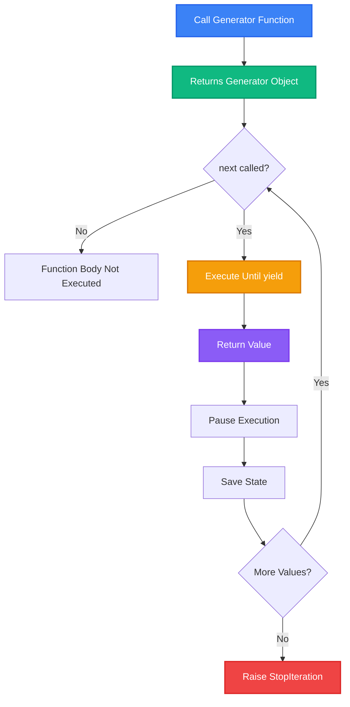
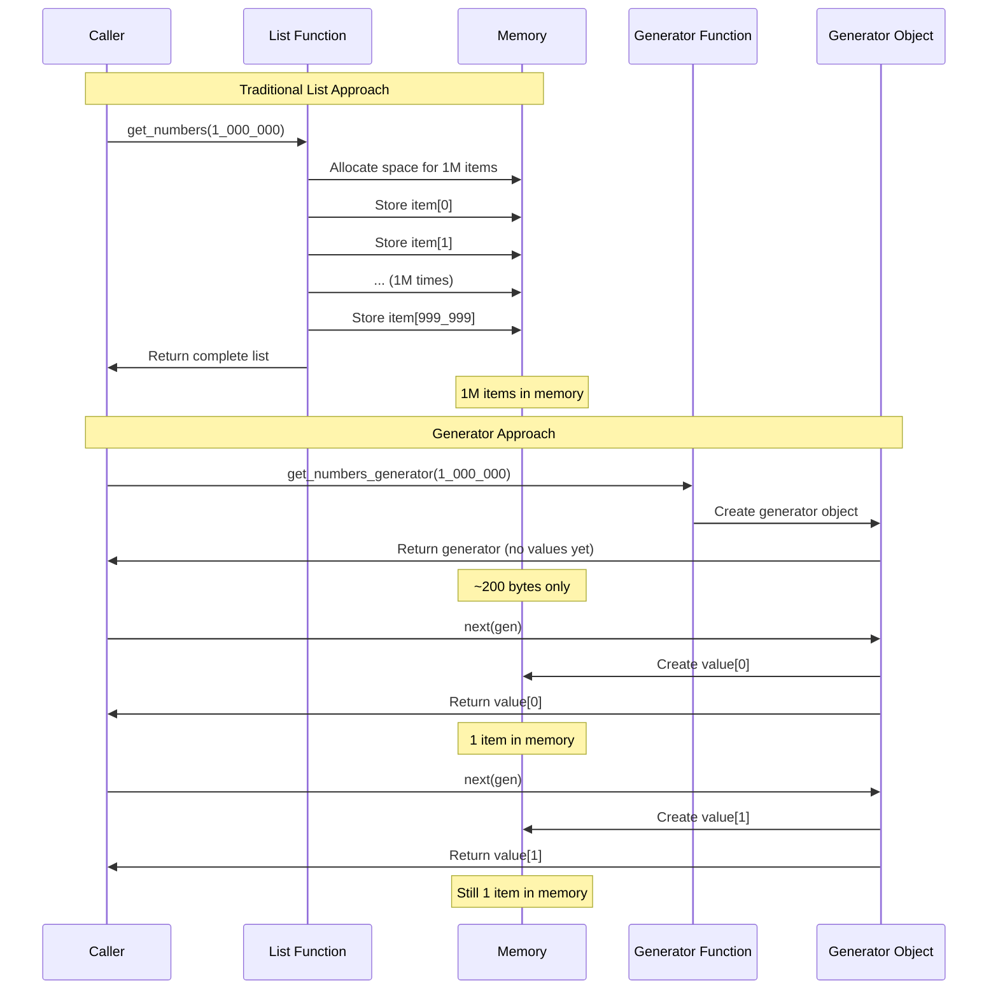
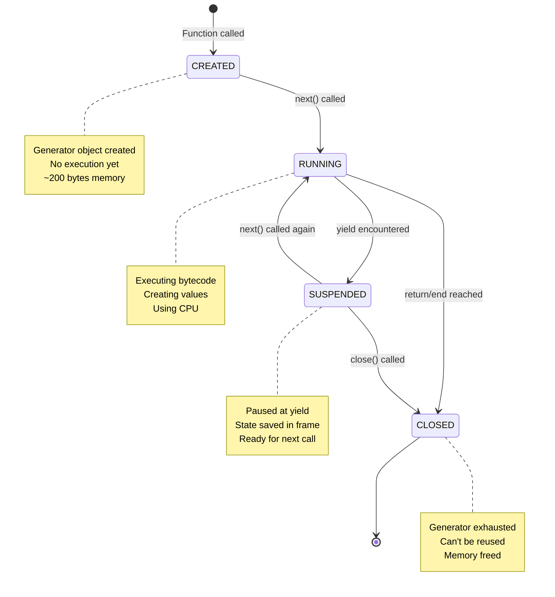
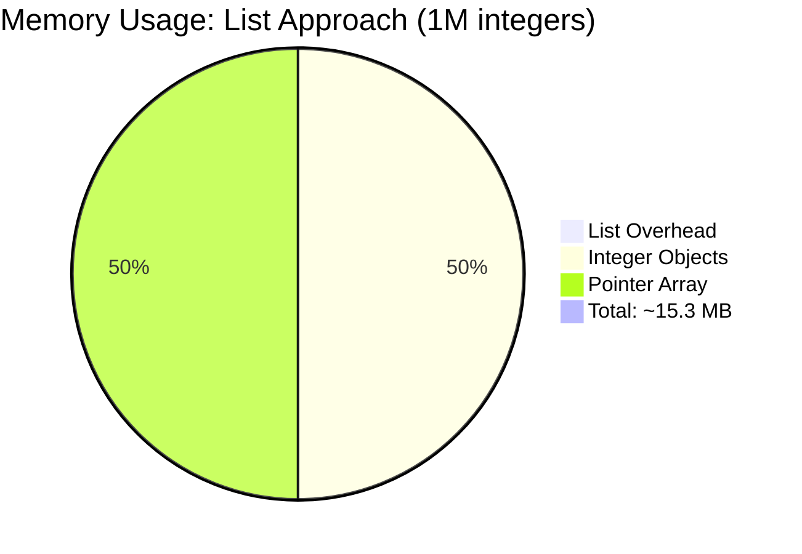
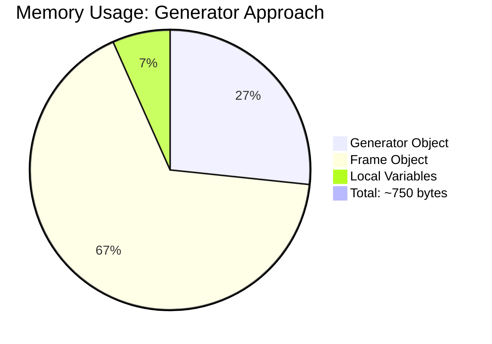
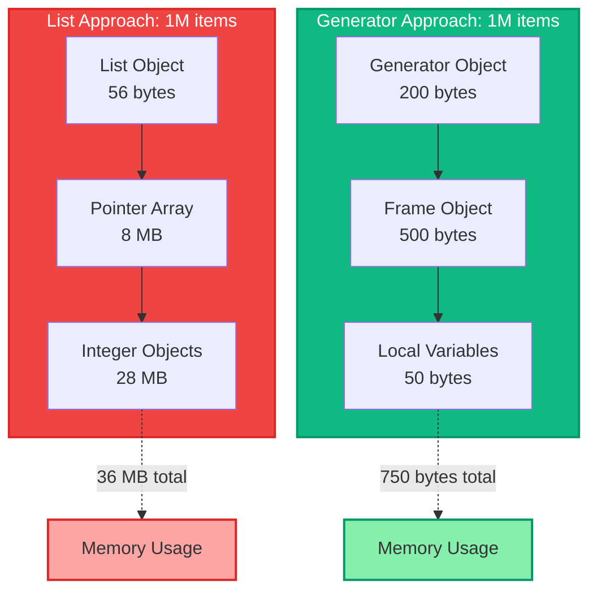
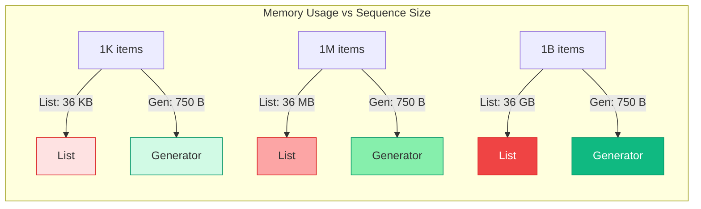
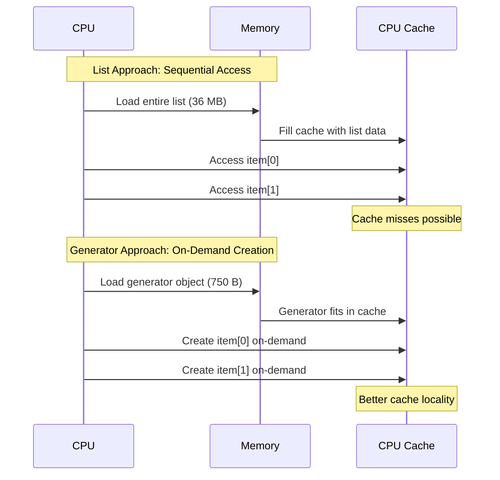

# Example 01: Memory-Intensive Approach - The Problem Generators Solve

This example demonstrates the fundamental problem that generators solve: **memory efficiency** when processing large datasets.

## Table of Contents

1. [High-Level: How Generators Work](#high-level-how-generators-work)
2. [Low-Level: Internal Implementation](#low-level-internal-implementation)
3. [Memory Comparison: Arrays vs Generators](#memory-comparison-arrays-vs-generators)
4. [Running the Example](#running-the-example)

---

## High-Level: How Generators Work

### The Core Concept

Generators are **lazy iterators** that produce values **on-demand** rather than creating them all at once. Think of them as a factory that manufactures items one at a time when requested, rather than a warehouse that stores everything upfront.

### Key Characteristics

1. **Lazy Evaluation**: Code doesn't execute until values are requested
2. **State Preservation**: Remembers where it left off between calls
3. **Memory Efficient**: Only holds one value (or a small batch) at a time
4. **Single-Pass**: Can only be iterated once (unless recreated)

### Execution Flow



### Example Comparison

**Traditional Approach (List):**
```python
def get_numbers(n):
    result = []  # Create empty list
    for i in range(n):
        result.append(i * 2)  # Store ALL values
    return result  # Return complete list

numbers = get_numbers(1_000_000)  # 1M items in memory NOW
```

**Generator Approach:**
```python
def get_numbers_generator(n):
    for i in range(n):
        yield i * 2  # Produce ONE value at a time

gen = get_numbers_generator(1_000_000)  # No values created yet!
first = next(gen)  # Only NOW is first value created
```

### Visual Comparison



---

## Low-Level: Internal Implementation

### Generator Object Structure

When Python encounters a `yield` statement, it transforms the function into a generator. Internally, Python creates a **generator object** that contains:

1. **Frame Object**: Contains the function's execution state
2. **Code Object**: The compiled bytecode
3. **Local Variables**: Current values of local variables
4. **Instruction Pointer**: Where execution paused (bytecode offset)
5. **Stack State**: Current stack frame state

### Pseudo-Code Implementation

Here's how Python internally implements generators (simplified):

```python
# Pseudo-code representation of generator internals

class GeneratorObject:
    def __init__(self, func, args, kwargs):
        self.func = func
        self.args = args
        self.kwargs = kwargs
        self.frame = None  # Execution frame
        self.state = 'CREATED'  # CREATED, RUNNING, SUSPENDED, CLOSED
        self.gi_code = func.__code__  # Bytecode
        self.gi_frame = None  # Frame object
        self.gi_running = False
        
    def __iter__(self):
        return self
        
    def __next__(self):
        if self.state == 'CLOSED':
            raise StopIteration
            
        if self.frame is None:
            # First call - create frame
            self.frame = create_frame(self.func, self.args, self.kwargs)
            self.state = 'RUNNING'
        
        # Execute bytecode until yield or return
        try:
            result = execute_frame_until_yield(self.frame)
            if result is YIELD_VALUE:
                self.state = 'SUSPENDED'
                return result.value
            elif result is RETURN_VALUE:
                self.state = 'CLOSED'
                raise StopIteration
        except Exception as e:
            self.state = 'CLOSED'
            raise
```

### Bytecode-Level Execution

When Python compiles a generator function, it transforms `yield` into specific bytecode operations:

```python
# Source code
def get_numbers_generator(n):
    for i in range(n):
        yield i * 2

# Simplified bytecode representation
"""
LOAD_FAST         0    # Load 'n'
LOAD_GLOBAL       0    # Load 'range'
CALL_FUNCTION     1    # Call range(n)
GET_ITER          0    # Get iterator
FOR_ITER          label1
STORE_FAST        1    # Store 'i'
LOAD_FAST         1    # Load 'i'
LOAD_CONST        2    # Load 2
BINARY_MULTIPLY   0    # i * 2
YIELD_VALUE       0    # YIELD HERE - pause execution
POP_TOP           0    # Clean up stack
JUMP_ABSOLUTE     label0
label1:
RETURN_VALUE      0    # End of generator
"""
```

### Frame Object Structure

The frame object (stored in `gi_frame`) contains:

```python
# Simplified frame structure
FrameObject:
    f_code: CodeObject          # Bytecode instructions
    f_locals: Dict[str, Any]    # Local variables {'n': 1000000, 'i': 42}
    f_globals: Dict[str, Any]   # Global namespace
    f_back: FrameObject          # Previous frame (caller)
    f_lasti: int                # Last instruction index (where we paused)
    f_lineno: int               # Current line number
    f_stack: List[Any]          # Evaluation stack
```

### Execution State Machine



### Memory Layout Comparison

**List Approach Memory Layout:**
```
Memory Address    | Value        | Size
------------------|--------------|-------
0x1000            | [0, 2, 4...] | 8 MB
                  | (1M items)   |
                  |              |
                  | All allocated|
                  | immediately  |
```

**Generator Approach Memory Layout:**
```
Memory Address    | Component           | Size
------------------|---------------------|-------
0x2000            | Generator Object    | ~200 bytes
                  | - gi_code           | (pointer)
                  | - gi_frame          | (pointer)
                  | - state flags       | (8 bytes)
                  |                     |
0x3000            | Frame Object        | ~500 bytes
                  | - f_locals: {n, i}  | (current state)
                  | - f_lasti: 42       | (instruction ptr)
                  | - f_stack: []       | (empty)
                  |                     |
                  | NO DATA VALUES      | (created on-demand)
```

---

## Memory Comparison: Arrays vs Generators

### Memory Usage Breakdown

#### List/Array Approach

For a list of 1 million integers:



**Memory Components:**
- **List Object Overhead**: ~56 bytes (Python object header)
- **Pointer Array**: 8 bytes × 1,000,000 = 8 MB (64-bit pointers)
- **Integer Objects**: ~28 bytes × 1,000,000 = 28 MB (Python int objects)
- **Total**: ~36 MB (varies by Python version and optimization)

#### Generator Approach



**Memory Components:**
- **Generator Object**: ~200 bytes (object header + pointers)
- **Frame Object**: ~500 bytes (execution state)
- **Local Variables**: ~50 bytes (n, i values)
- **Total**: ~750 bytes (constant, regardless of sequence size!)

### Visual Memory Comparison



### Scalability Comparison



**Key Insight**: Generator memory usage is **constant** regardless of sequence size, while list memory usage grows **linearly**.

### Why Generators Save Memory

1. **No Pre-allocation**: Values are created only when requested
2. **Single Value at a Time**: Only one value exists in memory at any moment
3. **State Preservation**: Only execution state is stored, not data values
4. **Lazy Evaluation**: Computation happens on-demand, not upfront

### Memory Access Patterns



### Real-World Impact

| Dataset Size | List Memory | Generator Memory | Savings |
|--------------|-------------|------------------|---------|
| 1,000 items  | 36 KB       | 750 B            | 48x     |
| 1,000,000 items | 36 MB    | 750 B            | 48,000x |
| 1,000,000,000 items | 36 GB | 750 B        | 48,000,000x |

**For 1 billion items:**
- List: Would require 36 GB RAM (often impossible!)
- Generator: Still only 750 bytes (always possible!)

---

## Running the Example

### Basic Execution

```bash
# Run the example
python src/examples/example-01-memory-intensive/main.py
```

### Expected Output

```
Non-generator approach stats:
Memory usage: 36.00 MB
Total count: 1000000
First 10 numbers: [0, 2, 4, 6, 8, 10, 12, 14, 16, 18]

⚠️  Problem: All data is loaded into memory at once!

Generator approach stats:
Memory usage: 200 bytes (much smaller!)
Note: Generators don't have len() - they produce values on-demand
First 10 numbers: [0, 2, 4, 6, 8, 10, 12, 14, 16, 18]

✅ Generators produce values on-demand, saving memory!
   But you can't get the length without consuming the generator.
```

### Interactive Exploration

```python
# Explore generator internals
import sys

gen = get_numbers_generator(1000)

# Check generator object size
print(f"Generator size: {sys.getsizeof(gen)} bytes")

# Check frame object (if available)
if hasattr(gen, 'gi_frame') and gen.gi_frame:
    print(f"Frame locals: {gen.gi_frame.f_locals}")
    print(f"Last instruction: {gen.gi_frame.f_lasti}")

# Get a value
value = next(gen)
print(f"First value: {value}")

# Check frame state after yielding
if hasattr(gen, 'gi_frame') and gen.gi_frame:
    print(f"Frame locals after yield: {gen.gi_frame.f_locals}")
```

---

## Key Takeaways

1. **Generators are lazy**: They don't execute until values are requested
2. **Constant memory**: Generator memory usage doesn't grow with sequence size
3. **State preservation**: Execution state is saved between `yield` statements
4. **Single-pass**: Generators can only be iterated once
5. **Scalability**: Generators enable processing datasets larger than available RAM

## Further Reading

- [Python Generator Documentation](https://docs.python.org/3/reference/expressions.html#yield-expressions)
- [PEP 255 - Simple Generators](https://peps.python.org/pep-0255/)
- [Example 02: First Generator](../example-02-first-generator/) - Learn to create your first generator
- [Example 03: How Generators Work](../example-03-how-generators-work/) - Deep dive into execution flow

