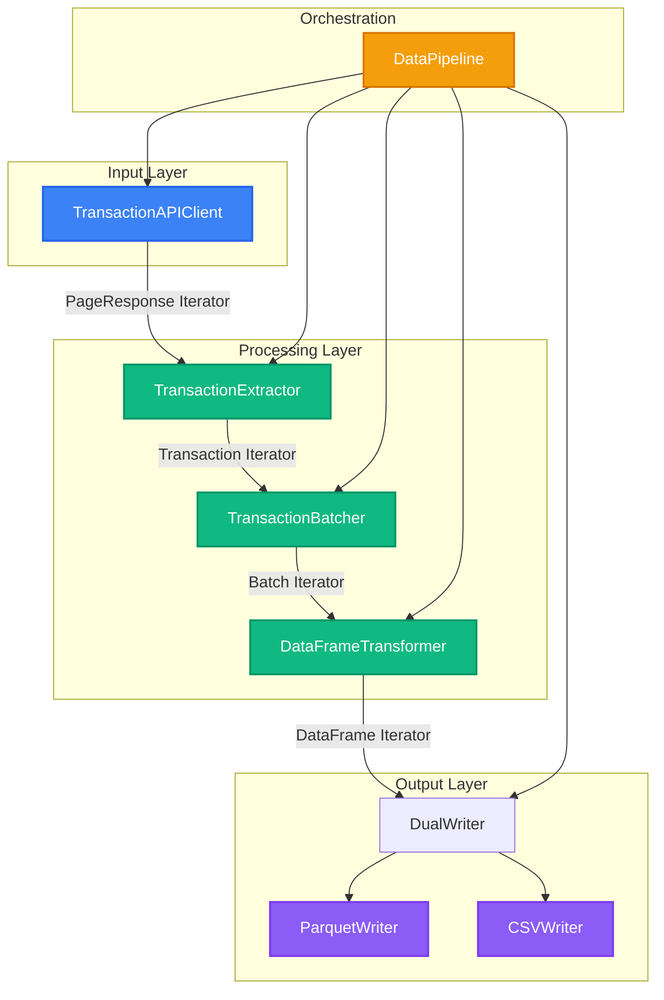
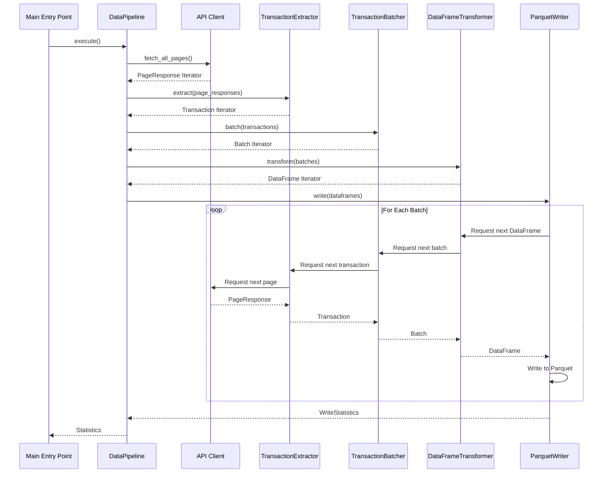
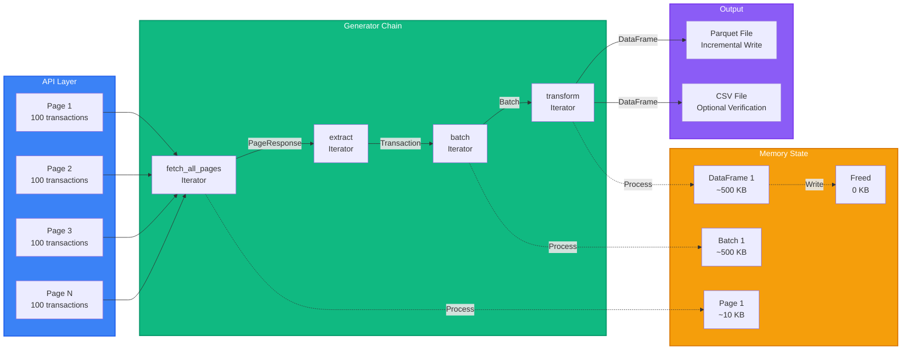
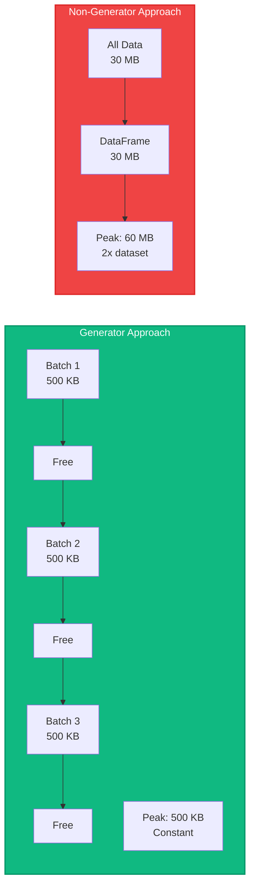

# Generator-Based Data Pipeline

A production-ready, memory-efficient data pipeline that demonstrates the power of Python generators for processing large datasets. This module converts paginated API data into Parquet format using a streaming, generator-based approach that maintains constant memory usage regardless of dataset size.

## Table of Contents

1. [Quick Start](#quick-start)
2. [Overview](#overview)
3. [Architecture](#architecture)
4. [Components](#components)
5. [Data Flow](#data-flow)
6. [Memory Efficiency](#memory-efficiency)
7. [Usage](#usage)
8. [Comparison: Generator vs Non-Generator](#comparison-generator-vs-non-generator)
9. [Design Patterns](#design-patterns)

---

## Quick Start

### Prerequisites

Make sure you have Poetry installed and dependencies are installed:

```bash
poetry install
```

### Running the Pipeline

#### Run Generator-Based Pipeline (Default)

```bash
poetry run python3 -m src.parquet_s3_blocks_writer.generator.main
```

This runs the memory-efficient generator-based pipeline and writes output to `transactions.parquet`.

#### Run Non-Generator Pipeline (For Comparison)

```bash
poetry run python3 -m src.parquet_s3_blocks_writer.generator.main --non-generator
```

This runs the non-generator approach that loads all data into memory (not recommended for large datasets).

#### Compare Both Approaches

```bash
poetry run python3 -m src.parquet_s3_blocks_writer.generator.main --compare
```

This runs both approaches and provides a detailed comparison of memory usage and performance.

### Command Line Options

- `--non-generator`: Use non-generator pipeline (loads all data into memory)
- `--compare`: Compare generator vs non-generator approaches

---

## Overview

This module implements a complete data pipeline that:

- ✅ **Fetches** transaction data from a paginated API
- ✅ **Processes** data in memory-efficient batches using generators
- ✅ **Transforms** data with proper type optimization
- ✅ **Writes** to Parquet format incrementally
- ✅ **Verifies** data integrity (optional CSV verification)
- ✅ **Compares** generator vs non-generator approaches

### Key Features

- **Memory Efficient**: Processes data in batches, maintaining constant memory usage
- **Scalable**: Can handle datasets of any size without running out of memory
- **Type Safe**: Uses dataclasses and enums for type safety
- **Well Structured**: Follows SOLID principles and clean architecture
- **Production Ready**: Includes logging, error handling, and verification

---

## Architecture

### High-Level Architecture



### Generator Chain Pattern

The pipeline uses a **generator chain** where each component produces an iterator that feeds into the next:



---

## Components

### 1. `main.py` - Entry Point

**Purpose**: Main entry point and CLI interface

**Key Functions**:
- `main(use_generator: bool)`: Orchestrates the pipeline execution
- `compare_approaches()`: Compares generator vs non-generator approaches

**Usage**:
```bash
# Run with generator-based pipeline (default)
poetry run python3 -m src.parquet_s3_blocks_writer.generator.main

# Run with non-generator pipeline (for comparison)
poetry run python3 -m src.parquet_s3_blocks_writer.generator.main --non-generator

# Compare both approaches
poetry run python3 -m src.parquet_s3_blocks_writer.generator.main --compare
```

### 2. `api_client.py` - API Client

**Purpose**: Simulates fetching transaction data from a paginated API

**Key Class**: `TransactionAPIClient`

**Methods**:
- `fetch_page(page: int) -> PageResponse`: Fetches a single page
- `fetch_all_pages() -> Iterator[PageResponse]`: **Generator** that yields all pages

**Example**:
```python
client = TransactionAPIClient(page_size=100, total_pages=300)

# Generator - yields pages one at a time
for page_response in client.fetch_all_pages():
    print(f"Page {page_response.page}: {len(page_response.data)} transactions")
```

**Memory Impact**: Only one page exists in memory at a time (~100 transactions)

### 3. `models.py` - Data Models

**Purpose**: Defines data structures and configuration

**Key Classes**:
- `Transaction`: Transaction data model (dataclass)
- `PageResponse`: API response wrapper (dataclass)
- `PipelineConfig`: Pipeline configuration (dataclass)
- `WriteStatistics`: Operation statistics (dataclass)
- Enums: `TransactionStatus`, `Currency`, `Category`, `PaymentMethod`

**Example**:
```python
config = PipelineConfig(
    page_size=100,
    batch_size=1000,
    total_pages=300,
    output_file=Path("transactions.parquet"),
    compression="snappy"
)
```

### 4. `processors.py` - Data Processing

**Purpose**: Transform data through the pipeline stages

#### `TransactionExtractor`

**Responsibility**: Flatten paginated structure into transaction stream

**Method**: `extract(page_responses: Iterator[PageResponse]) -> Iterator[Transaction]`

**Example**:
```python
extractor = TransactionExtractor()

# Generator - yields transactions one at a time
for transaction in extractor.extract(page_responses):
    print(transaction.transaction_id)
```

**Memory Impact**: Only one transaction exists in memory at a time

#### `TransactionBatcher`

**Responsibility**: Group transactions into batches for efficient processing

**Method**: `batch(transactions: Iterator[Transaction]) -> Iterator[List[Transaction]]`

**Example**:
```python
batcher = TransactionBatcher(batch_size=1000)

# Generator - yields batches
for batch in batcher.batch(transactions):
    print(f"Batch with {len(batch)} transactions")
    # Process batch...
```

**Memory Impact**: Only one batch exists in memory at a time (~1000 transactions)

#### `DataFrameTransformer`

**Responsibility**: Convert transaction batches to optimized DataFrames

**Method**: `transform(batches: Iterator[List[Transaction]]) -> Iterator[pd.DataFrame]`

**Example**:
```python
transformer = DataFrameTransformer()

# Generator - yields DataFrames one at a time
for df in transformer.transform(batches):
    print(f"DataFrame shape: {df.shape}")
    # DataFrame is optimized and ready for writing
```

**Memory Impact**: Only one DataFrame exists in memory at a time (~1000 rows)

**Optimizations**:
- `amount` converted to `float32` (saves 50% memory vs float64)
- `timestamp` converted to pandas datetime
- Adds metadata columns (`batch_number`, `processed_at`)

### 5. `writers.py` - Output Writers

**Purpose**: Write data to Parquet and/or CSV formats

#### `ParquetWriter`

**Responsibility**: Write DataFrames to Parquet format incrementally

**Features**:
- Context manager pattern (`with` statement)
- Streams DataFrames incrementally
- Initializes schema from first DataFrame
- Tracks statistics (rows, batches, file size, time)

**Example**:
```python
with ParquetWriter(output_path, compression="snappy") as writer:
    stats = writer.write(dataframes)
    print(f"Wrote {stats.total_rows} rows in {stats.total_batches} batches")
```

**Memory Impact**: Only one DataFrame exists in memory during writing

#### `CSVWriter`

**Responsibility**: Write DataFrames to CSV format (for verification)

**Features**:
- Context manager pattern
- Writes header on first batch
- Appends subsequent batches

**Example**:
```python
with CSVWriter(csv_path) as writer:
    stats = writer.write(dataframes)
```

#### `DualWriter`

**Responsibility**: Write to both Parquet and CSV simultaneously

**Features**:
- Uses `itertools.tee()` to create two independent iterators
- Buffers only the difference between iterators
- Coordinates writing to both formats

**Example**:
```python
writer = DualWriter(parquet_writer, csv_writer)
stats = writer.write(dataframes)
```

**Memory Note**: `tee()` buffers the difference between the two iterators, but since batches are small and CSV verification is optional, this is acceptable.

### 6. `pipeline.py` - Pipeline Orchestration

**Purpose**: Orchestrates the complete data pipeline

#### `DataPipeline`

**Responsibility**: Coordinate all pipeline components

**Key Method**: `execute() -> WriteStatistics`

**Pipeline Stages**:
1. **Fetch**: `api_client.fetch_all_pages()` → PageResponse Iterator
2. **Extract**: `extractor.extract()` → Transaction Iterator
3. **Batch**: `batcher.batch()` → Batch Iterator
4. **Transform**: `transformer.transform()` → DataFrame Iterator
5. **Write**: `writer.write()` → Write to Parquet/CSV

**Example**:
```python
config = PipelineConfig(
    output_file=Path("transactions.parquet"),
    page_size=100,
    batch_size=1000
)

api_client = TransactionAPIClient(page_size=config.page_size)
pipeline = DataPipeline(api_client, config)
stats = pipeline.execute()

print(f"Wrote {stats.total_rows} rows in {stats.elapsed_time:.2f}s")
```

#### `NonGeneratorPipeline`

**Purpose**: Non-generator approach for comparison

**Warning**: ⚠️ Loads ALL data into memory - NOT recommended for large datasets!

**How it works**:
1. Fetches all pages and accumulates in a list
2. Creates a single DataFrame from all data
3. Writes DataFrame to Parquet

**Memory Impact**: 
- Peak memory: 2-3x dataset size (list + DataFrame simultaneously)

#### `PipelineComparator`

**Purpose**: Compare generator vs non-generator approaches

**Features**:
- Memory profiling using `tracemalloc`
- Performance comparison
- Detailed statistics reporting

**Example**:
```python
comparator = PipelineComparator()
comparator.compare(generator_config, non_generator_output_path)
```

### 7. `utils.py` - Utilities

**Purpose**: Helper classes for file operations and profiling

#### `FileComparator`

**Responsibility**: Compare CSV files for data consistency

**Features**:
- Compares shape, columns, and data
- Sorts data for consistent comparison
- Reports differences

#### `ParquetReader`

**Responsibility**: Read Parquet files and convert to CSV

**Use Case**: Verify Parquet data by comparing with original CSV

#### `MemoryProfiler`

**Responsibility**: Profile memory usage of operations

**Features**:
- Uses `tracemalloc` for memory tracking
- Optional `psutil` integration for detailed stats
- Reports peak memory, current memory, execution time

### 8. `protocols.py` - Protocol Definitions

**Purpose**: Define interfaces for dependency inversion

**Key Protocol**: `LoggerProtocol`

**Benefits**:
- Allows swapping logger implementations
- Enables testing with mock loggers
- Follows Dependency Inversion Principle

---

## Data Flow

### Complete Data Flow Diagram



### Step-by-Step Execution

1. **API Fetch** (Generator):
   ```python
   page_responses = api_client.fetch_all_pages()
   # Yields: PageResponse(page=1), PageResponse(page=2), ...
   ```

2. **Extract Transactions** (Generator):
   ```python
   transactions = extractor.extract(page_responses)
   # Yields: Transaction(...), Transaction(...), ...
   ```

3. **Batch Transactions** (Generator):
   ```python
   batches = batcher.batch(transactions)
   # Yields: [Transaction, ...], [Transaction, ...], ...
   ```

4. **Transform to DataFrame** (Generator):
   ```python
   dataframes = transformer.transform(batches)
   # Yields: DataFrame(...), DataFrame(...), ...
   ```

5. **Write to Parquet** (Consumer):
   ```python
   writer.write(dataframes)
   # Consumes DataFrames one at a time, writes incrementally
   ```

**Key Point**: Nothing executes until the final consumer (`writer.write()`) starts iterating!

---

## Memory Efficiency

### Memory Consumption Pattern


### Memory Comparison Table

| Dataset Size | Generator Peak | Non-Generator Peak | Savings |
|--------------|----------------|-------------------|---------|
| 1,000 records | ~500 KB | ~2 MB | 4x |
| 10,000 records | ~500 KB | ~20 MB | 40x |
| 100,000 records | ~500 KB | ~200 MB | 400x |
| 1,000,000 records | ~500 KB | ~2 GB | 4000x |

**Key Insight**: Generator memory usage is **constant** (O(batch_size)), while non-generator is **linear** (O(total_records)).

### Why Generators Save Memory

1. **Lazy Evaluation**: Values created only when needed
2. **Single Batch**: Only one batch exists in memory at a time
3. **Immediate Freeing**: Memory freed after each batch is processed
4. **No Accumulation**: Data flows through pipeline like a stream

### Memory Timeline

```mermaid
flowchart LR
    subgraph Timeline["Memory Usage Timeline (Generator Approach)"]
        direction TB
        
        subgraph Batch1["Batch 1 Processing"]
            B1A[Fetch Pages 1-10<br/>~10 KB] --> B1B[Create Batch 1<br/>~500 KB]
            B1B --> B1C[Create DataFrame 1<br/>~500 KB]
            B1C --> B1D[Write to Parquet<br/>~500 KB]
            B1D --> B1E[Free Memory<br/>~0 KB]
        end
        
        B1E --> Batch2
        
        subgraph Batch2["Batch 2 Processing"]
            B2A[Fetch Pages 11-20<br/>~10 KB] --> B2B[Create Batch 2<br/>~500 KB]
            B2B --> B2C[Create DataFrame 2<br/>~500 KB]
            B2C --> B2D[Write to Parquet<br/>~500 KB]
            B2D --> B2E[Free Memory<br/>~0 KB]
        end
        
        B2E --> Batch3
        
        subgraph Batch3["Batch 3 Processing"]
            B3A[Fetch Pages 21-30<br/>~10 KB] --> B3B[Create Batch 3<br/>~500 KB]
            B3B --> B3C[Create DataFrame 3<br/>~500 KB]
            B3C --> B3D[Write to Parquet<br/>~500 KB]
            B3D --> B3E[Free Memory<br/>~0 KB]
        end
        
        B3E --> Peak[Peak Memory<br/>~500 KB<br/>Constant!]
    end
    
    style Batch1 fill:#D1FAE5,stroke:#059669,stroke-width:2px
    style Batch2 fill:#D1FAE5,stroke:#059669,stroke-width:2px
    style Batch3 fill:#D1FAE5,stroke:#059669,stroke-width:2px
    style Peak fill:#10B981,stroke:#059669,stroke-width:3px,color:#fff
    style B1E fill:#86EFAC,stroke:#059669,stroke-width:2px
    style B2E fill:#86EFAC,stroke:#059669,stroke-width:2px
    style B3E fill:#86EFAC,stroke:#059669,stroke-width:2px
```



**Peak Memory**: Constant at ~500 KB (one batch)

**Key Observation**: Memory usage follows a sawtooth pattern - it peaks at ~500 KB when processing each batch, then drops to near zero when memory is freed, maintaining a constant peak regardless of total dataset size.

---

## Usage

### Basic Usage

```python
from pathlib import Path
from parquet_s3_blocks_writer.generator import (
    TransactionAPIClient,
    DataPipeline,
    PipelineConfig
)

# Configure pipeline
config = PipelineConfig(
    output_file=Path("transactions.parquet"),
    page_size=100,
    batch_size=1000,
    total_pages=300
)

# Create API client
api_client = TransactionAPIClient(
    page_size=config.page_size,
    total_pages=config.total_pages
)

# Create and execute pipeline
pipeline = DataPipeline(api_client, config)
stats = pipeline.execute()

print(f"✅ Wrote {stats.total_rows:,} rows")
print(f"   File size: {stats.file_size_bytes / 1024 / 1024:.2f} MB")
print(f"   Time: {stats.elapsed_time:.2f} seconds")
```

### Command Line Usage

```bash
# Run generator-based pipeline (default)
poetry run python3 -m src.parquet_s3_blocks_writer.generator.main

# Run non-generator pipeline (for comparison)
poetry run python3 -m src.parquet_s3_blocks_writer.generator.main --non-generator

# Compare both approaches
poetry run python3 -m src.parquet_s3_blocks_writer.generator.main --compare
```

### Custom Configuration

```python
config = PipelineConfig(
    output_file=Path("custom_output.parquet"),
    page_size=50,              # Smaller pages
    batch_size=500,            # Smaller batches
    total_pages=1000,          # More pages
    compression="zstd",        # Different compression
    enable_csv_verification=False  # Disable CSV verification
)
```

### Advanced: Custom Components

```python
from parquet_s3_blocks_writer.generator.processors import (
    TransactionExtractor,
    TransactionBatcher,
    DataFrameTransformer
)
from parquet_s3_blocks_writer.generator.writers import ParquetWriter

# Create custom pipeline
extractor = TransactionExtractor()
batcher = TransactionBatcher(batch_size=2000)
transformer = DataFrameTransformer()

# Build generator chain
page_responses = api_client.fetch_all_pages()
transactions = extractor.extract(page_responses)
batches = batcher.batch(transactions)
dataframes = transformer.transform(batches)

# Write
with ParquetWriter(Path("output.parquet")) as writer:
    stats = writer.write(dataframes)
```

---

## Comparison: Generator vs Non-Generator

### Side-by-Side Comparison

| Aspect | Generator Approach | Non-Generator Approach |
|--------|-------------------|----------------------|
| **Memory Usage** | Constant (~500 KB) | Linear (2-3x dataset size) |
| **Peak Memory** | O(batch_size) | O(total_records) |
| **Scalability** | ✅ Handles any size | ❌ Limited by RAM |
| **Execution Model** | Streaming (lazy) | Eager (all at once) |
| **Memory Timeline** | Constant peaks | Single large peak |
| **Failure Risk** | Low (small batches) | High (large datasets) |
| **Code Complexity** | Moderate | Simple |

### Memory Usage Graph



### When to Use Each

**Use Generator Approach When**:
- ✅ Processing large datasets (>100K records)
- ✅ Memory is limited
- ✅ Need to scale to any dataset size
- ✅ Want constant memory usage

**Use Non-Generator Approach When**:
- ⚠️ Small datasets (<10K records)
- ⚠️ Memory is abundant
- ⚠️ Need simple, straightforward code
- ⚠️ Performance comparison/benchmarking

---

## Design Patterns

### 1. Generator Chain Pattern

**Pattern**: Each component produces an iterator that feeds into the next

**Benefits**:
- Lazy evaluation
- Memory efficiency
- Composable pipeline stages

**Example**:
```python
# Chain generators together
page_responses = api_client.fetch_all_pages()
transactions = extractor.extract(page_responses)
batches = batcher.batch(transactions)
dataframes = transformer.transform(batches)
```

### 2. Context Manager Pattern

**Pattern**: Use `with` statement for resource management

**Benefits**:
- Automatic cleanup
- Exception safety
- Clean resource handling

**Example**:
```python
with ParquetWriter(output_path) as writer:
    stats = writer.write(dataframes)
# Writer automatically closed
```

### 3. Dependency Inversion

**Pattern**: Depend on abstractions (protocols), not concrete implementations

**Benefits**:
- Testability
- Flexibility
- Loose coupling

**Example**:
```python
def __init__(self, logger: Optional[LoggerProtocol] = None):
    self._logger = logger or logging.getLogger(__name__)
```

### 4. Single Responsibility Principle

**Pattern**: Each class has one reason to change

**Benefits**:
- Maintainability
- Testability
- Clear separation of concerns

**Example**:
- `TransactionExtractor`: Only extracts transactions
- `TransactionBatcher`: Only batches transactions
- `DataFrameTransformer`: Only transforms to DataFrames

### 5. Iterator Protocol

**Pattern**: Implement `__iter__()` and `__next__()` (or use generators)

**Benefits**:
- Works with `for` loops
- Memory efficient
- Pythonic

**Example**:
```python
def fetch_all_pages(self) -> Iterator[PageResponse]:
    page = 1
    while True:
        response = self.fetch_page(page)
        yield response  # Generator implements iterator protocol
        if not response.has_more:
            break
        page += 1
```

---

## Key Takeaways

1. **Generators enable memory-efficient processing** of large datasets
2. **Generator chains** create composable, lazy pipelines
3. **Constant memory usage** regardless of dataset size
4. **Production-ready** with proper error handling and verification
5. **Well-structured** following SOLID principles

## Further Reading

- [Python Generators Crash Course](../../../docs/python-generators-crash-course.md)
- [Example 21: API to Parquet Pipeline](../../../examples/example-21-api-to-parquet-pipeline/)
- [Python Generator Documentation](https://docs.python.org/3/reference/expressions.html#yield-expressions)

