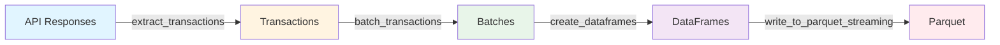
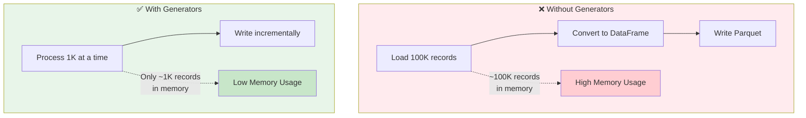

# Python Generators: From Novice to Advanced

> 📖 **See also**: [README.md](../../../../README.md) for project overview and [ARCHITECTURE.md](../../../../ARCHITECTURE.md) for architecture details.

I'll take you through a comprehensive journey of Python generators, building from fundamentals to advanced patterns.

This tutorial is part of the Parquet S3 Blocks Writer project. To see a practical implementation using generators, check out `generator/main.py` in this project.

## Part 1: The Foundation - Understanding the Problem

Before generators, if you wanted to process a large sequence, you'd create the entire list in memory:

```python
# Memory-intensive approach
def get_numbers(n):
    result = []
    for i in range(n):
        result.append(i * 2)
    return result

numbers = get_numbers(1000000)  # Creates 1 million items in memory!
```

**The Problem**: This loads everything into memory at once. For massive datasets, this is wasteful or impossible.

## Part 2: Enter Generators - Lazy Evaluation

Generators produce values **on-demand**, one at a time. They remember their state between calls.

### Your First Generator

```python
def count_up_to(n):
    count = 1
    while count <= n:
        yield count  # The magic keyword!
        count += 1

# Using it
counter = count_up_to(5)
print(next(counter))  # 1
print(next(counter))  # 2
print(next(counter))  # 3
```

**Key concept**: `yield` pauses the function and returns a value. Next time you call it, execution resumes right after the `yield`.

## Part 3: How Generators Actually Work

When you call a generator function, it returns a **generator object** (an iterator) but doesn't execute the function body yet.

```python
def simple_gen():
    print("Starting")
    yield 1
    print("Between yields")
    yield 2
    print("Ending")
    yield 3

gen = simple_gen()  # Nothing printed yet!
print(next(gen))    # Prints: Starting, then returns 1
print(next(gen))    # Prints: Between yields, then returns 2
print(next(gen))    # Prints: Ending, then returns 3
print(next(gen))    # Raises StopIteration
```

### The Iterator Protocol

Generators implement the iterator protocol automatically:

```python
gen = count_up_to(3)
print(iter(gen) is gen)  # True - it's its own iterator

# This is why you can use them in for loops
for num in count_up_to(5):
    print(num)  # Automatically calls next() until StopIteration
```

## Part 4: Generator Expressions

Just like list comprehensions, but lazy:

```python
# List comprehension - creates entire list
squares_list = [x**2 for x in range(1000000)]

# Generator expression - creates values on demand
squares_gen = (x**2 for x in range(1000000))

# Memory comparison
import sys
print(sys.getsizeof(squares_list))  # ~8 MB
print(sys.getsizeof(squares_gen))   # ~200 bytes
```

## Part 5: Practical Use Cases

### 1. Reading Large Files

```python
def read_large_file(file_path):
    with open(file_path, 'r') as file:
        for line in file:
            yield line.strip()

# Process millions of lines without loading all into memory
for line in read_large_file('huge_log.txt'):
    if 'ERROR' in line:
        print(line)
```

### 2. Infinite Sequences

```python
def fibonacci():
    a, b = 0, 1
    while True:
        yield a
        a, b = b, a + b

# Get first 10 Fibonacci numbers
fib = fibonacci()
first_10 = [next(fib) for _ in range(10)]
print(first_10)  # [0, 1, 1, 2, 3, 5, 8, 13, 21, 34]
```

### 3. Pipeline Processing

```python
def read_csv(filename):
    with open(filename) as f:
        for line in f:
            yield line.strip().split(',')

def filter_by_status(rows, status):
    for row in rows:
        if row[2] == status:
            yield row

def extract_names(rows):
    for row in rows:
        yield row[0]

# Chain generators together
pipeline = extract_names(
    filter_by_status(
        read_csv('users.csv'),
        'active'
    )
)

for name in pipeline:
    print(name)
```

## Part 6: Advanced - Generator Methods

Generators have three powerful methods:

### 1. send() - Send Values INTO the Generator

```python
def echo_generator():
    value = None
    while True:
        value = yield value
        if value is not None:
            value = f"Echo: {value}"

gen = echo_generator()
next(gen)  # Prime the generator
print(gen.send("Hello"))  # Echo: Hello
print(gen.send("World"))  # Echo: World
```

### 2. throw() - Inject Exceptions

```python
def resilient_processor():
    while True:
        try:
            data = yield
            print(f"Processing: {data}")
        except ValueError:
            print("Caught ValueError, continuing...")

gen = resilient_processor()
next(gen)
gen.send("valid data")
gen.throw(ValueError)  # Generator catches it
gen.send("more data")
```

### 3. close() - Stop the Generator

```python
def resource_handler():
    print("Acquiring resource")
    try:
        while True:
            yield "data"
    finally:
        print("Releasing resource")

gen = resource_handler()
next(gen)
gen.close()  # Triggers finally block
```

## Part 7: Advanced Patterns

### Coroutines (Pre-async/await)

```python
def averager():
    total = 0
    count = 0
    average = None
    while True:
        value = yield average
        total += value
        count += 1
        average = total / count

avg = averager()
next(avg)  # Prime it
print(avg.send(10))  # 10.0
print(avg.send(20))  # 15.0
print(avg.send(30))  # 20.0
```

### yield from - Delegating to Sub-generators

```python
def inner_gen():
    yield 1
    yield 2
    return "inner done"

def outer_gen():
    result = yield from inner_gen()  # Delegates completely
    print(f"Inner returned: {result}")
    yield 3

for value in outer_gen():
    print(value)
# Output: 1, 2, Inner returned: inner done, 3
```

### Generator-based State Machines

```python
def traffic_light():
    while True:
        yield "Green"
        yield "Yellow"
        yield "Red"

light = traffic_light()
for _ in range(7):
    print(next(light))
# Green, Yellow, Red, Green, Yellow, Red, Green
```

## Part 8: Performance and Best Practices

### Memory Efficiency

```python
import sys

# Compare memory usage
def sum_list(n):
    return sum([x for x in range(n)])

def sum_gen(n):
    return sum(x for x in range(n))

# Both return same result, but sum_gen uses way less memory
```

### When NOT to Use Generators

1. **When you need random access**: Generators are sequential only
2. **When you need the length**: `len()` doesn't work on generators
3. **When you need to iterate multiple times**: Generators are exhausted after one pass

```python
gen = (x for x in range(5))
list1 = list(gen)  # [0, 1, 2, 3, 4]
list2 = list(gen)  # [] - exhausted!

# Solution: Use a list, or recreate the generator
```

## Part 9: Real-World Advanced Example

### Data Processing Pipeline

```python
import json
from typing import Iterator, Dict

def read_json_lines(filename: str) -> Iterator[Dict]:
    """Read newline-delimited JSON file"""
    with open(filename) as f:
        for line in f:
            yield json.loads(line)

def filter_events(events: Iterator[Dict], event_type: str) -> Iterator[Dict]:
    """Filter events by type"""
    for event in events:
        if event.get('type') == event_type:
            yield event

def transform_event(events: Iterator[Dict]) -> Iterator[Dict]:
    """Transform events"""
    for event in events:
        yield {
            'timestamp': event['ts'],
            'user': event['user_id'],
            'action': event['action']
        }

def batch(iterator: Iterator, n: int) -> Iterator[list]:
    """Batch items into groups of n"""
    batch_items = []
    for item in iterator:
        batch_items.append(item)
        if len(batch_items) == n:
            yield batch_items
            batch_items = []
    if batch_items:
        yield batch_items

# Use the pipeline
pipeline = batch(
    transform_event(
        filter_events(
            read_json_lines('events.jsonl'),
            'click'
        )
    ),
    100
)

for batch_of_events in pipeline:
    # Process 100 events at a time
    process_batch(batch_of_events)
```

## Part 10: Common Patterns & Tricks

### Tee - Clone a Generator

```python
from itertools import tee

gen = (x**2 for x in range(5))
gen1, gen2 = tee(gen, 2)  # Create 2 independent iterators

print(list(gen1))  # [0, 1, 4, 9, 16]
print(list(gen2))  # [0, 1, 4, 9, 16]
```

### islice - Slice a Generator

```python
from itertools import islice

def infinite_counter():
    n = 0
    while True:
        yield n
        n += 1

# Get items 10-15
counter = infinite_counter()
chunk = list(islice(counter, 10, 15))
print(chunk)  # [10, 11, 12, 13, 14]
```

### chain - Combine Generators

```python
from itertools import chain

gen1 = (x for x in range(3))
gen2 = (x for x in range(3, 6))

combined = chain(gen1, gen2)
print(list(combined))  # [0, 1, 2, 3, 4, 5]
```

I'll add a comprehensive section demonstrating API pagination with generators and bulk Parquet writing. Let me create this as a new section:

## Part 11: Real-World Case Study - Paginated API to Parquet Pipeline

### The Challenge

You need to fetch transaction data from a paginated API, process it efficiently, and write to Parquet format without loading everything into memory at once.

### Complete Implementation

```python
import pandas as pd
import pyarrow as pa
import pyarrow.parquet as pq
from typing import Iterator, Dict, List
from datetime import datetime, timedelta
import random
import time

# ============================================================================
# Step 1: Simulate the Paginated API
# ============================================================================

def get_transactions_api(page: int, page_size: int = 100) -> Dict:
    """
    Simulates a paginated API call that returns transaction data.
    In reality, this would be requests.get(f'{BASE_URL}/transactions?page={page}')
    """
    # Simulate API latency
    time.sleep(0.1)
    
    # Generate random transaction data for this page
    transactions = []
    start_id = (page - 1) * page_size
    
    for i in range(page_size):
        transaction = {
            'transaction_id': f'TXN{start_id + i:08d}',
            'user_id': f'USER{random.randint(1000, 9999)}',
            'amount': round(random.uniform(10.0, 5000.0), 2),
            'currency': random.choice(['USD', 'EUR', 'GBP', 'JPY']),
            'status': random.choice(['completed', 'pending', 'failed']),
            'category': random.choice(['food', 'transport', 'entertainment', 'shopping', 'bills']),
            'timestamp': (datetime.now() - timedelta(days=random.randint(0, 365))).isoformat(),
            'merchant': random.choice(['Amazon', 'Uber', 'Netflix', 'Starbucks', 'Apple']),
            'payment_method': random.choice(['credit_card', 'debit_card', 'paypal', 'crypto'])
        }
        transactions.append(transaction)
    
    return {
        'data': transactions,
        'page': page,
        'page_size': page_size,
        'has_more': page < random.randint(5, 20)  # Random total pages between 5-20
    }


# ============================================================================
# Step 2: Generator to Fetch All Pages
# ============================================================================

def fetch_all_pages(page_size: int = 100) -> Iterator[Dict]:
    """
    Generator that yields API responses page by page.
    Automatically handles pagination until no more data.
    """
    page = 1
    while True:
        print(f"Fetching page {page}...")
        response = get_transactions_api(page, page_size)
        yield response
        
        if not response['has_more']:
            print(f"Reached last page: {page}")
            break
        
        page += 1


# ============================================================================
# Step 3: Generator to Extract Transaction Records
# ============================================================================

def extract_transactions(api_responses: Iterator[Dict]) -> Iterator[Dict]:
    """
    Generator that extracts individual transaction records from API responses.
    Flattens the paginated structure into a stream of transactions.
    """
    for response in api_responses:
        for transaction in response['data']:
            yield transaction


# ============================================================================
# Step 4: Generator to Batch Transactions
# ============================================================================

def batch_transactions(transactions: Iterator[Dict], batch_size: int = 1000) -> Iterator[List[Dict]]:
    """
    Generator that batches transactions into groups for efficient DataFrame creation.
    This is crucial for memory efficiency - we don't want to accumulate all records.
    """
    batch = []
    for transaction in transactions:
        batch.append(transaction)
        if len(batch) >= batch_size:
            yield batch
            batch = []
    
    # Don't forget the last partial batch
    if batch:
        yield batch


# ============================================================================
# Step 5: Generator to Create DataFrames
# ============================================================================

def create_dataframes(batches: Iterator[List[Dict]]) -> Iterator[pd.DataFrame]:
    """
    Generator that converts batches of transactions into pandas DataFrames.
    Each DataFrame represents a batch that will be written to Parquet.
    """
    for batch_num, batch in enumerate(batches, 1):
        df = pd.DataFrame(batch)
        
        # Data type optimization
        df['amount'] = df['amount'].astype('float32')
        df['timestamp'] = pd.to_datetime(df['timestamp'])
        
        # Add metadata
        df['batch_number'] = batch_num
        df['processed_at'] = datetime.now()
        
        print(f"Created DataFrame batch {batch_num} with {len(df)} records")
        yield df


# ============================================================================
# Step 6: Write to Parquet in Bulk Using PyArrow
# ============================================================================

def write_to_parquet_streaming(
    dataframes: Iterator[pd.DataFrame],
    output_file: str,
    compression: str = 'snappy'
):
    """
    Writes DataFrames to a single Parquet file using PyArrow.
    Uses streaming approach - writes batches incrementally.
    """
    writer = None
    total_rows = 0
    
    try:
        for df in dataframes:
            # Convert pandas DataFrame to PyArrow Table
            table = pa.Table.from_pandas(df)
            
            # Initialize writer on first batch (infers schema from first table)
            if writer is None:
                writer = pq.ParquetWriter(
                    output_file,
                    table.schema,
                    compression=compression
                )
            
            # Write this batch to the Parquet file
            writer.write_table(table)
            total_rows += len(df)
            print(f"Written {len(df)} rows (total: {total_rows})")
        
        print(f"\n✅ Successfully wrote {total_rows} total rows to {output_file}")
    
    finally:
        if writer:
            writer.close()


# ============================================================================
# Alternative: Write Multiple Parquet Files (Partitioned)
# ============================================================================

def write_to_parquet_partitioned(
    dataframes: Iterator[pd.DataFrame],
    output_dir: str,
    partition_by: str = 'category',
    compression: str = 'snappy'
):
    """
    Writes DataFrames to multiple Parquet files partitioned by a column.
    Useful for large datasets that need to be queried by specific fields.
    """
    import os
    os.makedirs(output_dir, exist_ok=True)
    
    writers = {}  # Cache writers for each partition
    total_rows = 0
    
    try:
        for df in dataframes:
            # Group by partition column
            for partition_value, group_df in df.groupby(partition_by):
                partition_path = os.path.join(
                    output_dir,
                    f"{partition_by}={partition_value}",
                    "data.parquet"
                )
                
                # Create directory for partition
                os.makedirs(os.path.dirname(partition_path), exist_ok=True)
                
                # Convert to PyArrow Table
                table = pa.Table.from_pandas(group_df)
                
                # Get or create writer for this partition
                if partition_value not in writers:
                    writers[partition_value] = pq.ParquetWriter(
                        partition_path,
                        table.schema,
                        compression=compression
                    )
                
                writers[partition_value].write_table(table)
                total_rows += len(group_df)
                print(f"Written {len(group_df)} rows to partition {partition_by}={partition_value}")
        
        print(f"\n✅ Successfully wrote {total_rows} total rows across {len(writers)} partitions")
    
    finally:
        for writer in writers.values():
            writer.close()


# ============================================================================
# Step 7: Putting It All Together - The Complete Pipeline
# ============================================================================

def pipeline_api_to_parquet(
    output_file: str = 'transactions.parquet',
    page_size: int = 100,
    batch_size: int = 1000
):
    """
    Complete pipeline: API -> Generator Chain -> Parquet
    
    Pipeline stages:
    1. fetch_all_pages: Yields API responses page by page
    2. extract_transactions: Flattens to individual transactions
    3. batch_transactions: Groups transactions into batches
    4. create_dataframes: Converts batches to DataFrames
    5. write_to_parquet_streaming: Writes to Parquet incrementally
    """
    print("🚀 Starting API to Parquet pipeline...\n")
    start_time = time.time()
    
    # Build the generator pipeline
    api_responses = fetch_all_pages(page_size)
    transactions = extract_transactions(api_responses)
    batches = batch_transactions(transactions, batch_size)
    dataframes = create_dataframes(batches)
    
    # Execute the pipeline by consuming the final generator
    write_to_parquet_streaming(dataframes, output_file)
    
    elapsed = time.time() - start_time
    print(f"\n⏱️  Pipeline completed in {elapsed:.2f} seconds")


# ============================================================================
# Step 8: Advanced - Parallel Processing with Generators
# ============================================================================

from concurrent.futures import ThreadPoolExecutor
from queue import Queue
import threading

def fetch_pages_parallel(max_workers: int = 5) -> Iterator[Dict]:
    """
    Fetches multiple pages in parallel using ThreadPoolExecutor.
    Still yields results in order using a queue.
    """
    # First, determine total pages
    first_response = get_transactions_api(1)
    yield first_response
    
    if not first_response['has_more']:
        return
    
    # Estimate total pages (in real scenario, API would tell us)
    total_pages = random.randint(5, 20)
    
    def fetch_page(page_num):
        return get_transactions_api(page_num)
    
    with ThreadPoolExecutor(max_workers=max_workers) as executor:
        # Submit all page requests
        futures = {
            executor.submit(fetch_page, page): page 
            for page in range(2, total_pages + 1)
        }
        
        # Yield results as they complete
        for future in futures:
            try:
                response = future.result()
                yield response
            except Exception as e:
                print(f"Error fetching page: {e}")


# ============================================================================
# Step 9: Usage Examples
# ============================================================================

if __name__ == "__main__":
    print("=" * 80)
    print("Example 1: Basic Pipeline - API to Single Parquet File")
    print("=" * 80)
    pipeline_api_to_parquet(
        output_file='transactions.parquet',
        page_size=100,
        batch_size=1000
    )
    
    print("\n" + "=" * 80)
    print("Example 2: Partitioned Parquet Files by Category")
    print("=" * 80)
    api_responses = fetch_all_pages(page_size=100)
    transactions = extract_transactions(api_responses)
    batches = batch_transactions(transactions, batch_size=500)
    dataframes = create_dataframes(batches)
    write_to_parquet_partitioned(dataframes, 'transactions_partitioned', partition_by='category')
    
    print("\n" + "=" * 80)
    print("Example 3: Reading Back the Parquet File")
    print("=" * 80)
    df_result = pd.read_parquet('transactions.parquet')
    print(f"\nTotal transactions loaded: {len(df_result)}")
    print(f"Memory usage: {df_result.memory_usage(deep=True).sum() / 1024**2:.2f} MB")
    print(f"\nSample data:")
    print(df_result.head())
    print(f"\nTransactions by status:")
    print(df_result['status'].value_counts())
    print(f"\nTransactions by category:")
    print(df_result['category'].value_counts())


# ============================================================================
# Step 10: Performance Comparison - With vs Without Generators
# ============================================================================

def pipeline_without_generators(output_file: str = 'transactions_no_gen.parquet'):
    """
    NON-GENERATOR approach for comparison.
    Loads everything into memory first - BAD for large datasets!
    """
    print("⚠️  Non-generator approach (loads all data into memory)...\n")
    start_time = time.time()
    
    # Fetch all data at once
    all_transactions = []
    page = 1
    while True:
        response = get_transactions_api(page)
        all_transactions.extend(response['data'])
        if not response['has_more']:
            break
        page += 1
    
    # Convert to single DataFrame
    df = pd.DataFrame(all_transactions)
    df['amount'] = df['amount'].astype('float32')
    df['timestamp'] = pd.to_datetime(df['timestamp'])
    
    # Write to Parquet
    df.to_parquet(output_file, compression='snappy', engine='pyarrow')
    
    elapsed = time.time() - start_time
    print(f"✅ Wrote {len(df)} rows to {output_file}")
    print(f"⏱️  Completed in {elapsed:.2f} seconds")
    print(f"💾 Peak memory usage: ~{df.memory_usage(deep=True).sum() / 1024**2:.2f} MB")


# ============================================================================
# Memory Efficiency Demonstration
# ============================================================================

def compare_approaches():
    """
    Compares memory usage between generator and non-generator approaches.
    """
    import tracemalloc
    
    print("\n" + "=" * 80)
    print("MEMORY COMPARISON")
    print("=" * 80)
    
    # Generator approach
    print("\n1️⃣  Generator Approach:")
    tracemalloc.start()
    pipeline_api_to_parquet('transactions_gen.parquet', page_size=50, batch_size=200)
    current, peak = tracemalloc.get_traced_memory()
    tracemalloc.stop()
    print(f"Peak memory usage: {peak / 1024**2:.2f} MB")
    
    # Non-generator approach
    print("\n2️⃣  Non-Generator Approach:")
    tracemalloc.start()
    pipeline_without_generators('transactions_no_gen.parquet')
    current, peak = tracemalloc.get_traced_memory()
    tracemalloc.stop()
    print(f"Peak memory usage: {peak / 1024**2:.2f} MB")
    
    print("\n💡 Notice how the generator approach uses less peak memory!")
    print("   This difference becomes HUGE with millions of records.")


# Run the comparison
if __name__ == "__main__":
    compare_approaches()
```

### Key Takeaways from This Implementation

**1. Generator Chain Pattern**: Each stage processes and yields data without accumulating it:



**2. Memory Efficiency**: By batching (e.g., 1000 records at a time), we never hold the entire dataset in memory.

**3. PyArrow Streaming**: `ParquetWriter` allows us to append tables incrementally to the same file.

**4. Lazy Evaluation**: Nothing executes until we start consuming the final generator in `write_to_parquet_streaming`.

**5. Scalability**: This pattern handles millions of records efficiently. If you have 100 pages × 1000 records = 100K records, you only hold ~1000 in memory at once.

### Why This Matters



This approach is production-ready and scales to datasets with millions of transactions while maintaining constant memory usage! 🚀

## Summary: Key Takeaways

1. **Generators are lazy**: They produce values on-demand, saving memory
2. **Use `yield`**: Pauses function execution and returns a value
3. **One-time use**: Generators are exhausted after iteration
4. **Perfect for**: Large datasets, infinite sequences, pipelines
5. **Iterator protocol**: Generators implement `__iter__()` and `__next__()` automatically
6. **Advanced features**: `send()`, `throw()`, `close()`, and `yield from`

Generators are one of Python's most elegant features for writing memory-efficient, readable code. Master them, and you'll write better Python!

## Related Documentation

- **[README.md](../../../../README.md)** - Project overview and main documentation
- **[ARCHITECTURE.md](../../../../ARCHITECTURE.md)** - Detailed architecture documentation
- **[QUICKSTART.md](../../../../QUICKSTART.md)** - Quick start guide
- **[WRITERS_COMPARISON.md](../../../../WRITERS_COMPARISON.md)** - Comparison of writer implementations
- **[docs/parquet-writer-s3-output-stream.md](../../../../docs/parquet-writer-s3-output-stream.md)** - Technical deep dive into S3 streaming

## Running the Generator Example

To see generators in action with this project:

```bash
# Using Poetry with Python module syntax (recommended)
poetry run python -m parquet_s3_blocks_writer.generator.main

# Or activate the virtual environment first
poetry shell
python -m parquet_s3_blocks_writer.generator.main
```

This example demonstrates:
- Generator chains for processing large datasets
- Memory-efficient data processing
- CSV verification of Parquet data integrity
- Comprehensive memory usage comparison